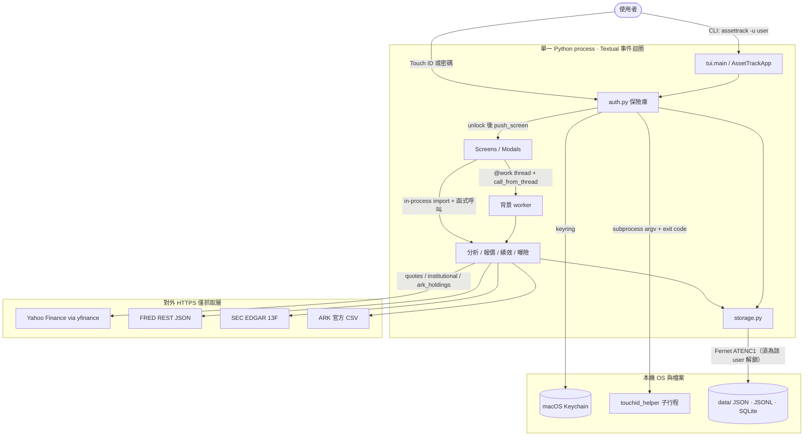
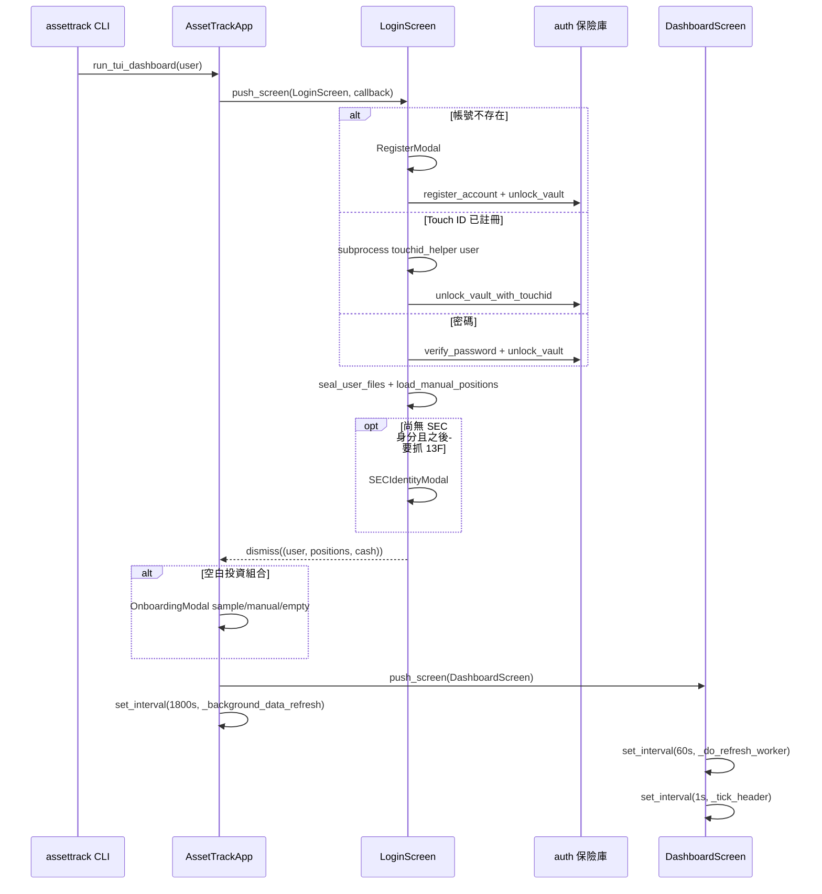
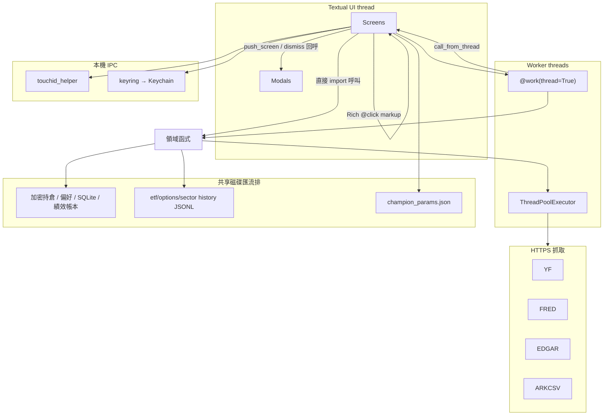
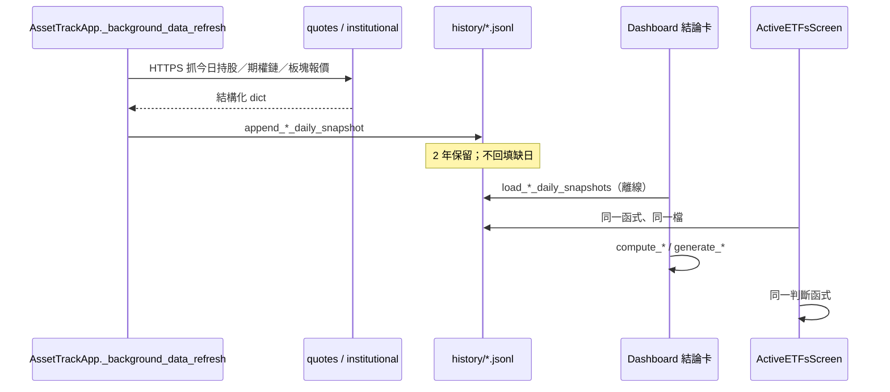
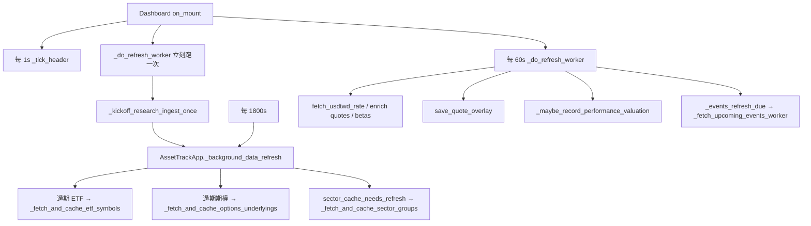
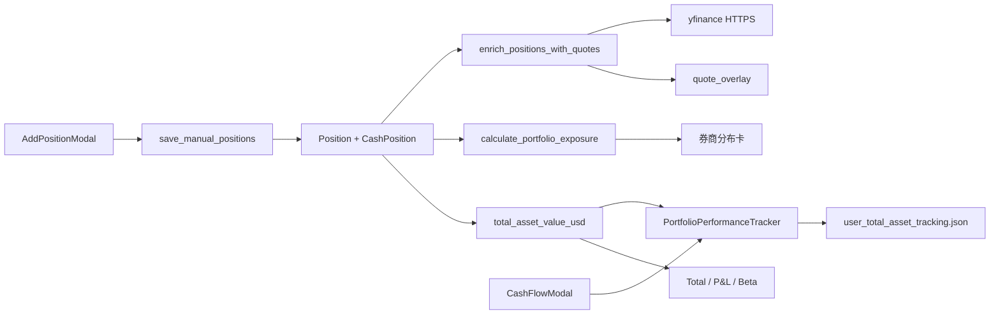
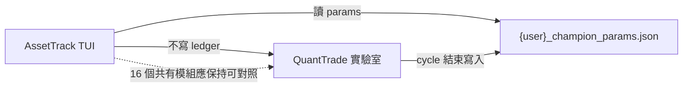

# AssetTrack 系統運作技術文件

最後依據：2026-08-27。本文件描述**目前工作樹**的正統架構，不是 QuantTrade 分家前的實驗室產品，也不是已刪除的 `INVESTMENT_LOGIC.md`。

AssetTrack 是單行程、離線優先的全螢幕 Textual TUI。沒有內部 HTTP API、沒有訊息佇列、沒有微服務。畫面、分析、儲存、認證全部在同一個 Python process 裡用函式呼叫與磁碟檔案交換資料；唯一的跨行程通訊是登入時的 Touch ID helper。對外網路只發生在抓取層（Yahoo Finance、FRED、SEC EDGAR、ARK CSV）。

---

## 1. 系統定位與邊界

| 本套件做 | 本套件不做 |
|---|---|
| 多券商手動持倉、報價、匯率、曝險、績效追蹤 | 券商 API 自動匯入、下單、券商同步 |
| 四大分析畫面與主頁結論卡 | 策略實驗室（Forecast Ledger、Promotion、鍵 `0`／`k`） |
| 讀取 QuantTrade 匯出的 Champion 門檻 | 寫入或晉升 Recommendation Policy |
| 本機真實快照的離線重算與 walk-forward 回測函式庫 | 把未通過驗證的方向預測當成可執行投資建議 |

2026-08-06 起，實驗引擎已搬到 QuantTrade。AssetTrack 只保留分析函式與唯讀參數契約：`data/{user}_champion_params.json`。契約不存在時回退 `calibration_schedule` 的 legacy 狀態。`apply_pending()` 會拋 `CalibrationReadOnlyError`，TUI 不再提供校準畫面。

投資建議層一律以**美股為主**。台股／TWD 只出現在持倉、報價與匯率換算；`shared.is_taiwan_position()` 是排除台股建議的唯一判定來源。

---

## 2. 總體架構



### 2.1 邏輯分層

```mermaid
flowchart LR
    subgraph L1["L1 呈現"]
        S["tui.py Screens"]
        M["Modals"]
        R["Recommendation 三層投影"]
    end
    subgraph L2["L2 編排"]
        W["Textual @work"]
        T["set_interval"]
        P["_active_params"]
    end
    subgraph L3["L3 領域"]
        A["analysis / sector_* / options_*"]
        Q["quotes"]
        PF["performance"]
        EX["exposure"]
        I["institutional"]
    end
    subgraph L4["L4 持久化與金鑰"]
        ST["storage"]
        AU["auth"]
        SI["sec_identity"]
    end
    L1 --> L2 --> L3 --> L4
```



L1 不直接打網路。L2 決定何時抓、何時重算。L3 是純領域規則（多數分析函式零網路）。L4 負責加密檔、Keychain 與快取路徑。

---

## 3. 啟動與畫面導航



Dashboard 快捷鍵與目的地：

| 鍵 | 動作 | 目的地 |
|---|---|---|
| `1` | 新增部位 | `AddPositionModal` |
| `2` / `r` | 立即重整報價 | `_do_refresh_worker` |
| `3` / `q` | 安全登出 | `LogoutConfirmModal` → `end_session`（fence worker、`lock_vault`） |
| `4` | 近期重大事件 | `UpcomingEventsScreen` |
| `5` | 儲存市值快照 | `Storage.save_snapshot` |
| `6` | 主動式 ETF | `ActiveETFsScreen` |
| `7` | 期權觀察 | `OptionsWatchlistScreen` |
| `8` | 類股板塊 | `SectorAnalysisScreen` |
| `9` | 績效比較 | `PerformanceTrackingScreen` |
| `i` / `o` | 入金／出金 | `CashFlowModal` |

畫面之間**沒有** Textual 自訂 `Message` / `post_message`。導航一律是 `app.push_screen(screen, callback)`，結果用 `dismiss(value)` 回到 callback。

---

## 4. 各區塊職責

### 4.1 呈現層（`assettrack/tui.py`）

唯一 CLI 進入點：`pyproject.toml` 的 `assettrack = "assettrack.tui:main"`。

| 區塊 | 類別 | 職責 |
|---|---|---|
| 主應用 | `AssetTrackApp` | 登入生命週期、30 分鐘全域補抓、跨畫面 `_fetch_activity` 狀態列 |
| 登入 | `LoginScreen` + 認證 Modal | 帳號、密碼、Touch ID、註冊、SEC 身分、新手導覽 |
| 主看板 | `DashboardScreen` | 持倉、指標、券商分布、三張結論卡、近期事件摘要 |
| 事件 | `UpcomingEventsScreen` | 財報／FED／NFP／CPI 月曆與總經解讀 |
| ETF | `ActiveETFsScreen` / `AdvancedAnalysisScreen` | 觀察清單建議、研究全表、13F |
| 期權 | `OptionsWatchlistScreen` / `OptionRichnessHistoryScreen` | 已觀察樣態、IV−RV、Greeks；不輸出股價方向 |
| 類股 | `SectorAnalysisScreen` | 2-of-3 十個交易日預測與板塊 CRUD |
| 績效 | `PerformanceTrackingScreen` | 完整資產 vs QQQ／VT 影子基準 |
| 公式 | `RecommendationDetailScreen` | 一則 `Recommendation` 的第三層 breakdown |

### 4.2 領域層

| 模組 | 職責 | 是否打網路 |
|---|---|---|
| `shared.py` | `Recommendation`、台股判定、總經日程、三層投影 | 否 |
| `models.py` | `Position`、`CashPosition`、市值／損益 | 否 |
| `analysis.py` | ETF 雙訊號趨勢、觀察清單建議、回測 | 否（只讀快照） |
| `institutional.py` | AUM>$5B 主動式 universe、SEC 13F | 是（Yahoo screener + EDGAR） |
| `etf_trades.py` | 前後持股狀態差分 | 否 |
| `ark_holdings.py` | ARK 官方 CSV | 是 |
| `options_analysis.py` | 已觀察 regime、Greeks、函式庫內方向引擎 | 否 |
| `options_valuation.py` | ATM IV vs 20 日 RV 貴賤 | 否 |
| `options_forecasting.py` | proper-score 閘門（TUI 不呼叫） | 否 |
| `sector_analysis.py` | 廣度 + 2-of-3 複合政策 | 否 |
| `sector_predictive.py` | 確認票與 1–3 session 條件機率（畫面不顯示後者） | 否 |
| `calibration.py` | 期權 walk-forward 回測函式庫 | 否 |
| `calibration_schedule.py` | 唯讀參數狀態 | 否 |
| `backtest_stats.py` | Wilson／二項／ESS／Bonferroni | 否 |
| `direction_forecast_validation.py` | 家族盲 PASS/FAIL/UNDERPOWERED | 否 |
| `quotes.py` | 報價、匯率、財報、FRED、ETF 持股、期權鏈 | 是 |
| `performance.py` | 績效帳本與影子基準 | 報價由呼叫端注入 |
| `exposure.py` | 總／淨曝險與槓桿 | 否 |
| `greeks.py` | Black-Scholes | 否 |
| `market_sessions.py` | NYSE 交易日曆 | 否 |

### 4.3 持久化與安全

| 模組 | 職責 |
|---|---|
| `storage.py` | 路徑、持倉 JSON、SQLite 快照、三套 `history/*.jsonl`、watchlist、偏好 |
| `auth.py` | PBKDF2 密碼、Fernet 保險庫、Touch ID 註冊旗標 |
| `sec_identity.py` | SEC Fair Access 名稱＋信箱（獨立 Keychain service） |

---

## 5. 區塊之間如何溝通

這是本文件的核心：每個箭頭都寫明**機制**與**協定**。AssetTrack 沒有內部 REST。所謂「協定」是實際承載資料的契約。

### 5.1 溝通總圖



### 5.2 協定一覽

| # | 溝通雙方 | 機制 | 協定／契約 | 承載 |
|---|---|---|---|---|
| 1 | CLI → App | 行程內函式 | `main()` → `run_tui_dashboard(user)` | 帳號字串 |
| 2 | Screen ↔ Modal | Textual 畫面堆疊 | `push_screen(modal, callback)` + `dismiss(value)` | typed 回傳值（`bool`、`str`、`list[Holding]`、`dict`） |
| 3 | 使用者 → Screen | Textual 綁定 | `BINDINGS` / `on_key` / `on_button_pressed` / `on_data_table_cell_selected` | 按鍵與 widget 事件 |
| 4 | 建議卡 → 公式頁 | Rich markup 點選 | `[@click=screen.show_formula('rN')]` → `_FormulaDrillMixin.action_show_formula` | token → `Recommendation` |
| 5 | UI thread ↔ worker | Textual worker | `@work(thread=True)` + `app.call_from_thread(fn, …)`；寫檔前查 `_session_generation_matches` | 不可在 worker 直接改 widget；舊世代放棄寫入 |
| 6 | App ↔ Dashboard | 共享 App 狀態 | `AssetTrackApp._fetch_activity`、`_session_id` | 狀態列文案；登出世代 |
| 7 | 各畫面 ↔ 分析模組 | Python import | 同步函式呼叫，回傳 `dict` / `list[Recommendation]` | 無序列化、無 RPC |
| 8 | 分析 ↔ 快取 | 檔案 I/O | UTF-8 JSON / JSONL（一行一個物件） | 逐日真實快照 |
| 9 | TUI ↔ 持倉 | 受保護文字 | `read_protected_text` / `write_protected_text(..., user=)`；前綴 `ATENC1:` + Fernet。`user` 必須等於 `_vault_user` | 加密 JSON；鎖定或帳號不符則不寫檔 |
| 10 | TUI ↔ SQLite | 臨時解密檔 | `protected_sqlite(..., user=)`：`ATENC1\n` + Fernet → temp file → `sqlite3` | 市值快照；同樣綁定帳號 |
| 11 | auth ↔ OS | keyring | service/account/password 三元組 | 密碼雜湊、資料金鑰、Touch ID 旗標、SEC 身分 |
| 12 | Login ↔ Touch ID | 子行程 | `subprocess.run([touchid_helper, user], capture_output=True)`；只看 **exit code**（0 成功、1 失敗、2 不可用） | 無 stdin/stdout 協定 |
| 13 | quotes ↔ Yahoo | HTTPS（yfinance 封裝） | Yahoo Finance HTTP；`ThreadPoolExecutor` 並行 | 報價、持股、期權鏈、財報日 |
| 14 | quotes ↔ FRED | HTTPS REST | `GET https://api.stlouisfed.org/fred/series/observations?file_type=json` + `FRED_API_KEY` | 通膨／就業／利率序列 |
| 15 | institutional ↔ SEC | HTTPS + Fair Access | `User-Agent: "{name} {email}"`；全域鎖、請求間隔 ≥ 130 ms | 13F-HR JSON／XML |
| 16 | ark_holdings ↔ ARK | HTTPS | `GET https://assets.ark-funds.com/fund-documents/funds-etf-csv/…` | 官方持股 CSV |
| 17 | Dashboard ↔ 門檻 | 唯讀 JSON 契約 | `{user}_champion_params.json` 的 `params`；失敗回退 calibration | ETF／類股／期權門檻 |
| 18 | 背景補抓 ↔ 畫面 | 磁碟匯流排 | worker 寫 JSONL，畫面稍後讀同一路徑 | 不靠記憶體事件通知 |
| 19 | 績效 ↔ 持倉管控 | 同一 process 的領域 API | `PortfolioPerformanceTracker.apply_position_purchase/sale` | 現金守恆 |

### 5.3 畫面導航協定（Textual callback）

```text
Dashboard.action_active_etfs()
    → app.push_screen(ActiveETFsScreen(user, positions, rate))
        → 使用者按 a
            → app.push_screen(AdvancedAnalysisScreen(...))
                → dismiss()
        → 使用者按 Esc
            → dismiss()
    → 回到 Dashboard（無回傳值也可）
```

Modal 一定有回傳契約。例如：

| Modal | `dismiss` 型別 | 呼叫端如何接 |
|---|---|---|
| `PasswordModal` | `bool` | 成功才 `_login_success` |
| `AddPositionModal` | `Optional[list[Holding]]` | 寫入持倉並刷新 |
| `CashFlowModal` | `Optional[dict]` | `declare_cash_flow` + 調整現金 |
| `OnboardingModal` | `"sample" \| "manual" \| "empty"` | 決定第一筆資料 |
| `SECIdentityModal` | `bool` | 是否寫入 Keychain |

### 5.4 背景執行緒協定

所有網路與重計算都離開 UI thread。

```text
@work(thread=True)
def _do_refresh_worker(...):
    fetch_usdtwd_rate()          # HTTPS
    enrich_positions_with_quotes()
    save_quote_overlay(...)
    self.app.call_from_thread(self._render_all)
```

規則：

1. Worker 可以讀寫 `storage`、呼叫 `quotes`／分析函式。
2. Worker **不得**直接設定 Textual widget；必須 `call_from_thread`。
3. `exclusive=True` 用在全域補抓與部分日曆／板塊抓取，避免重入覆寫快取。
4. ETF／期權明細抓取另開 `ThreadPoolExecutor(max_workers=2)`；報價層最多約 10 個 worker。

App 層狀態列用記憶體 dict，不是檔案：

```text
AssetTrackApp._set_fetch_active("quotes", "即時報價與匯率")
DashboardScreen._tick_header() 每秒讀 _fetch_activity 重繪 #status-bar
```

### 5.5 磁碟匯流排（畫面之間的真正資料通道）

Dashboard 結論卡與各分析頁**不互相呼叫**。它們讀同一批本機快照。



這就是「結論＝被回測＝同一函式」的物理基礎：畫面與回測都只吃 ≤T 的 JSONL，不吃即時 yfinance 重算歷史。

### 5.6 認證與加密協定

```text
Keychain
  service=assettrack_user_auth     account={user}  → PBKDF2-SHA256（390000 次）
  service=assettrack_data_key      account={user}  → 32-byte hex 資料金鑰
  service=assettrack_touchid       account={user}  → "enrolled"
  service=assettrack_sec_identity  account={user}  → {display_name, email, consent…}

行程內保險庫
  unlock_vault / unlock_vault_with_touchid
    → _vault_key + _vault_user（threading.Lock 保護，供 worker 共用）
  current_vault_user()
    → 已解鎖帳號，否則 None
  lock_vault / end_session
    → 清除記憶體金鑰並遞增 App._session_id；登出時呼叫
  受保護 I/O
    → write/read/protected_sqlite 皆需 user=，且 user == _vault_user
    → VaultLocked / VaultUserMismatch 時不碰磁碟（既有 ATENC1 密文保留）

檔案
  明文 JSON ──僅當 vault 已為該 user 解鎖──► "ATENC1:" + Fernet token
  SQLite 整個檔 ──► b"ATENC1\n" + Fernet token
  鎖定或帳號不符時禁止把密文改寫成明文，也禁止用別人的金鑰重封
```

Touch ID **不**把密碼傳進 Swift。helper 只做 `LocalAuthentication` 裝置擁有者驗證；Python 看到 exit code 0 後，用 Keychain 裡既有的 data key 開保險庫。因此 Touch ID 只能解鎖「這台裝置曾經用密碼登入過」的帳號。

### 5.7 對外 HTTPS 協定細節

**Yahoo Finance（yfinance）**

- 函式：`fetch_price`、`fetch_prices_batch`、`fetch_etf_holdings`、`fetch_options_snapshot`、`fetch_earnings_calendar`、`yf.screen`（主動式 ETF universe）等。
- 傳輸：函式庫對 Yahoo 的 HTTPS。TUI 不組 URL。
- 批次：報價 `chunk_size=20`；ETF 績效 `chunk_size=15` 並間隔 0.3s。
- 記憶體 TTL：匯率 1 小時；beta／無風險利率 6 小時。另有 `data/quote_warmup_cache.json`。

**FRED**

- `GET https://api.stlouisfed.org/fred/series/observations`
- Query：`series_id`、`file_type=json`、`sort_order=desc`、`limit`、`api_key`
- 缺 key 或失敗：該指標整段省略，不編造。

**SEC EDGAR 13F**

1. `GET https://data.sec.gov/submissions/CIK{010d}.json`
2. 篩 `13F-HR` / `13F-HR/A`
3. `GET https://www.sec.gov/Archives/edgar/data/{cik}/{accession}/index.json`
4. `GET` 最大的 information-table XML
5. Header：`User-Agent: "{display_name} {email}"`（SEC Fair Access）
6. 行程內全域鎖，兩次請求至少間隔 130 ms
7. 身分只從**目前登入帳號**的 Keychain 讀取，不寫入 `.env` 或快取檔

**ARK**

- 官方 CSV HTTPS，供進階研究表補每日完整持股。

### 5.8 Champion 參數契約

```text
data/{user}_champion_params.json
{
  "params": {
    "etf":     {"consensus_threshold": 0.5, "min_etfs_evaluated": 4},
    "sector":  {"breadth_threshold": 0.5, "min_days": 3},
    "options": {"bias_min_pct": 0.03}
  },
  "policy_version_ids": { ... }
}
```

讀取順序（`_active_params`）：

1. Champion JSON 的 `params`
2. `{user}_calibration.json` 的 `active_params`
3. `calibration_schedule.default_params()`
4. 空 dict（渲染不得因此崩潰）

AssetTrack 只讀不寫 Champion。QuantTrade 在自己的 feedback cycle 結束後覆寫這份檔。兩邊沒有 socket，靠使用者機器上的同一 `data/` 目錄。

### 5.9 建議物件在畫面之間的流動

所有使用者可見建議（事件、ETF 觀察清單、類股預測）都先做成 `shared.Recommendation`，再投影三次：

| 投影 | 函式 | 用在 |
|---|---|---|
| 一句話 | `dashboard_line(rec)` | 主頁卡片 |
| 兩層＋連結 | `render_detail_recs` / `detail_headline` | 各分析頁 |
| 完整公式 | `RecommendationDetailScreen` | 點選 🔍 |

```text
分析函式 → list[Recommendation]
    → render_detail_recs → (markup, {r0: rec, r1: rec, …})
    → 畫面 _remember_recs(mapping)
    → 使用者點 [@click=screen.show_formula('r0')]
    → push_screen(RecommendationDetailScreen(rec))
```

這不是 HTTP，是 Rich 把 click action 轉成 Textual `action_show_formula`。

---

## 6. 資料檔與保留政策

資料根目錄：`Path.cwd() / "data"`（`storage.get_data_dir()`）。

### 6.1 登入後加密（須為該 user 解鎖才用 Fernet 覆寫）

| 路徑 | 內容 |
|---|---|
| `{user}_positions.json` | 證券 + 現金 |
| `{user}_assettrack.db` | 市值快照、部位歷史、交易列 |
| `{user}_preferences.json` | 例如事件時區 |
| `{user}_event_history.json` | 已保留財報事件 |
| `{user}_quote_overlay.json` | 上次即時報價，供首屏 |
| `{user}_total_asset_tracking.json` | 績效帳本 |

`user=="default"` 仍相容舊路徑 `./positions.json`、`data/assettrack.db`。

### 6.2 明文研究快取（跨使用者共享行情，不加密）

| 路徑 | 內容 |
|---|---|
| `etf_cache/{SYM}.json` | 當日持股／AUM／價格 |
| `etf_cache/history/{SYM}.jsonl` | 逐日持股狀態 |
| `options_cache/history/{U}.jsonl` | 逐日期權鏈快照 |
| `sector_cache/history/{GROUP}.jsonl` | 逐日板塊成員報價 |
| `benchmark_cache/history/{SYM}.jsonl` | 回測用 adjusted close |
| `active_etf_universe.json` | Yahoo screener 結果 |
| `institution_cache/13F_{CIK}.json` | 四家機構 13F |
| `{user}_options_watchlist.json` | 手動期權標的 |
| `{user}_etf_watchlist.json` | ETF 觀察清單 |
| `sector_cache/{user}_sector_groups.json` | 自訂板塊 |
| `sector_cache/{user}_predictive.json` | 確認模型快取 |
| `{user}_champion_params.json` | QuantTrade 契約 |
| `{user}_calibration.json` | legacy 唯讀狀態 |

### 6.3 保留

- 分析快照與 benchmark truth：`ANALYSIS_CACHE_RETENTION_DAYS = 730`（兩年）
- 期權波動貴賤走勢畫面：`RICHNESS_HISTORY_DAYS = 90`
- 事件歷史：只保留當月與上個月
- 不回填、不臆測；缺日就是缺日

### 6.4 快取新鮮度

| 資料 | 視為新鮮 |
|---|---|
| ETF 單檔 | `last_refreshed` 為台灣今日，且價格／AUM／持股完整、狀態非 retryable |
| 期權單檔 | 最新快照日期 = 最近一個應有的美股 session |
| 板塊 | 美股開盤：快取年齡 ≥ 60s 就重抓；收盤後：快取早於上次收盤就重抓 |
| 日曆摘要 | 成功後 6 小時；失敗 15 分鐘重試 |
| 主動式 universe／13F | 每個台灣日曆日最多刷新一次 |

---

## 7. 背景更新時序



各分析頁另有自己的 `run_background_fetch`：進入該頁會再補抓一次。主頁分析卡每 5 分鐘或持倉簽名變化才重算（`_DASHBOARD_ANALYSIS_REFRESH_SECONDS`），避免 60 秒報價刷新帶動三次全量離線分析。

---

## 8. 持倉、報價、曝險、績效如何接在一起



績效追蹤開啟時，持倉不再是自由編輯：

- 買證券：必須從同券商／帳戶／幣別現金扣款（`apply_position_purchase`）
- 刪證券：視為賣出，現值轉回現金（`apply_position_sale`）
- 現金只能走 `i`／`o` 出入金，並同步調整 QQQ／VT 影子單位數

這是領域 API 約束，不是資料庫 trigger。

---

## 9. 四大分析功能的內部資料流

### 9.1 近期重大事件（鍵 `4`）

```text
持倉代號 ∪ SOX 十大
    → quotes.fetch_earnings_calendar（並行 HTTPS）
硬編碼 FED/NFP/CPI 日程
    → shared.get_upcoming_macro_events（時區轉 Asia/Taipei 或使用者偏好）
已公布總經
    → quotes.fetch_latest_macro_readings（FRED HTTPS）
    → shared.macro_recommendations（direction=None，資訊性）
Dashboard 摘要
    → 只抓未來 30 天、最多 8 筆；與完整日曆 worker 分開，避免把實際值契約塞進首頁快取
```

### 9.2 主動式 ETF（鍵 `6`）

```text
institutional.ensure_active_etf_universe
    → yf.screen（美股交易所、AUM > $5B）
    → 名稱／說明必須像主動管理，排除明顯被動
每日
    → fetch_etf_holdings + 價格 → etf_cache + history JSONL
畫面
    → compute_symbol_trends（14 日窗、股數Δ + 權重Δ 雙訊號）
    → watchlist_etf_activity + render_etf_advice_view
進階表
    → 同一趨勢報告 + compute_institution_trends（13F）
13F
    → ensure_hedge_fund_filings → EDGAR HTTPS → institution_cache
    → 也 append 到 etf_cache/history/13F:{CIK}.jsonl
```

### 9.3 期權觀察（鍵 `7`）

```text
持倉標的 ∪ 手動 watchlist（排除台股）
    → fetch_options_snapshot → options_cache/history JSONL
畫面
    → compute_expected_move
    → options_valuation.richness_from_history（RV=20 交易日）
    → compute_portfolio_greeks（僅選擇權部位）
    → compute_observed_regime（主頁卡）
不呼叫
    → generate_options_recommendations
    → compute_directional_verdicts（函式庫仍在）
    → options_forecasting.assess_option_forecast
```

### 9.4 類股板塊（鍵 `8`）

```text
使用者板塊成員
    → fetch_sector_members_data → sector_cache/history JSONL
背景
    → sector_predictive.build_prediction_model
    → 只把 sector_confirmation 給畫面當 Vote B/C
畫面
    → detect_broad_flow（Vote A）
    → assess_sector_composite / generate_sector_recommendations
    → 預測窗 = 10 個 NYSE session
不顯示
    → generate_prediction_recommendations（1–3 日條件機率；僅測試）
```

---

## 10. 與 QuantTrade 的關係



溝通方式：同一台機器的共用檔案，不是網路協定。AssetTrack 刪除了 `cross_model.py` 與實驗畫面；CONTEXT.md 仍保留實驗詞彙，是為了兩邊語言對齊，不是因為本套件還實作實驗引擎。

方向政策若日後要重新上線，必須先通過 `direction_forecast_validation.validate`（家族盲、剛好 +h 個 NYSE session 結算、重疊 purge、n<30 一律 UNDERPOWERED）。`gate.passed` 不是 Promotion。

---

## 11. 每個項目的投資建議邏輯

本章說明**使用者現在看得到的判斷**，以及函式庫裡還在、但畫面已切斷的邏輯。共通寫作格式是三層 `Recommendation`：結論 → 依據 → 公式細節。

### 11.1 共通紀律

1. **台股不進建議。** `is_taiwan_position()` 依市場／幣別／`.TW`／`.TWO` 判定。
2. **不回填。** 沒有當日真實快照就顯示「資料收集中／來源未更新」，不拿昨天假裝今天。
3. **雙真實訊號。** ETF 要股數與權重同向；類股當日廣度要擴散指數與市值加權報酬同向。單一指標不足。
4. **平手不是多。** 多空檔數相等歸 `mixed`／觀望，避免系統性多頭偏誤。
5. **回測與畫面同一函式。** walk-forward 只餵 ≤T 快照。樣本不足就標累積中，不當調參證據。
6. **未驗證方向不得假裝可執行。** 期權方向引擎因此退出 TUI。

門檻來源見 §5.8。預設：

| 家族 | 參數 | 預設 | 作用 |
|---|---|---|---|
| etf | `consensus_threshold` | 0.5 | 跨基金多數性 |
| etf | `min_etfs_evaluated` | 4 | 少於此檔數不列入個股共識排行（完整引擎） |
| sector | `breadth_threshold` | 0.5 | 當日「普遍」廣度 |
| sector | `min_days` | 3 | 5 日窗至少幾日同向 |
| options | `bias_min_pct` | 0.03 | 僅函式庫方向引擎；畫面不用 |

---

### 11.2 近期重大事件與總經 — 資訊，不投票

**輸入：** 持倉財報日、SOX 十大財報、硬編碼總經日程、FRED 實際值。

**規則：** `macro_recommendations()` 的 `direction` 永遠是 `None`。每則建議只報本期值、上期值、Δ 與文字解讀。

| 指標 | 公式 | 解讀方向（不是下單指令） |
|---|---|---|
| 核心 CPI / 核心 PCE | ΔMoM = 本期月增 − 上期月增 | Δ<0 通膨動能放緩；Δ>0 粘性回升 |
| NFP | Δ人數 = 本期新增 − 上期新增 | 降溫減薪資壓力；過熱可能延後寬鬆 |
| 失業率 | Δpp = 本期 − 上期 | 上升偏降溫；下降偏緊俏 |
| 有效聯邦資金利率 | Δpp = 本期 − 上期 | 下行偏寬鬆；上行偏緊縮 |

**棄權：** FRED 缺值或未設定 API key → 該指標整段不出現。

**回測：** 無。這不是預測家族。

**畫面：** `UpcomingEventsScreen` 用 `render_detail_recs`；Dashboard 右側只列未來事件，不做總經建議。

---

### 11.3 主動式 ETF — 觀察清單上的真實買賣

主頁與鍵 `6` 預設頁**不是**完整的 `generate_etf_recommendations`（大類輪動＋規模性大額）。使用者看見的是觀察清單過濾後的活動。

#### 單檔 ETF、單一持股如何判定增／減碼

`compute_symbol_trends(..., window_days=14, flat_threshold_pp=0.5, endpoint_k=3)`：

1. 把 14 日內快照依持股狀態簽名摺疊；來源完全沒變記 `source_unchanged`，不得寫成「今日無交易」。
2. 視窗兩端各取最多 3 筆快照的中位數，降低單日揭露雜訊。
3. **股數方向：** 用當日 `AUM × 權重 ÷ 持股價` 反推股數，看 Δ 正負。
4. **權重方向：** 權重變化絕對值 < 0.5 個百分點視為持平。
5. 兩方向同為增或同為減 → 該 ETF 對該標的有確認交易；任一缺席或相反 → 持平、不計入。

#### 跨基金共識

`consensus_from_counts`：

```text
pct_up = n_up / evaluated
若 pct_up ≥ consensus_threshold 且 pct_up > pct_down → "up"
對稱得到 "down"
平手 → "mixed"
```

#### 觀察清單建議（實際 TUI）

`_watchlist_activity_recommendation`：

| 狀態 | 使用者看到 | direction |
|---|---|---|
| 來源未更新且無交易 | ⚪ 來源持股揭露未更新 | `None` |
| 沒有雙訊號確認 | ⚪ 無確認增減持 | `None` |
| 只有買入側 | 🟢 買入／增碼 | `多` |
| 只有賣出側 | 🔴 賣出／減碼 | `空` |
| 兩側同時有 | ⚪ 買賣同時出現 | `觀望` |

主頁卡再把有交易的列截成最多 3 行。未設定觀察清單時，主頁明確要求先按 `6` 設定，不拿全宇宙當建議。

#### 完整引擎（函式庫，進階研究表不用 Recommendation 卡）

`generate_etf_recommendations` 仍會產出：

1. **個股多數性：** 至少 `min_etfs_evaluated` 檔評估、共識 up/down。
2. **大類資產輪動：** 各 ETF 的 `asset_classes` 權重在 14 日窗同向達門檻。
3. **規模性大額：** 單一基金 `|市值Δ| ≥ US$5M` 且 `|市值Δ| / AUM ≥ 0.5%`，故意不套跨基金門檻。

部位一致性（`position_stance_by_symbol`）只是提示「你已偏多／偏空」，不是加減碼指令。

#### 回測

`backtest_etf_consensus`：每個歷史日 T 只用 ≤T 快照重跑 `compute_symbol_trends`，再看之後真實價格。統計：Wilson CI、對基準二項、ESS、Bonferroni。`min_signals=20` 未達標顯示累積中。本機快照仍短，**尚未**用 `direction_forecast_validation` 正式打 PASS/FAIL。

---

### 11.4 13F 機構 — 研究表，不是下單建議

追蹤 Bridgewater、Citadel、Millennium、Elliott 的季度 13F。

`compute_institution_trends`：

- 用**申報股數**（`reported_share_signal=True`），沒有權重第二訊號。
- 相對變化門檻 5%（`rel_share_threshold=0.05`）。
- 相鄰兩季比較；共識門檻預設 50%。
- Put/Call 只顯示增持／減持。13F 不揭露履約價與到期、也不區分買權還是賣權，**禁止**推論看多看空。

畫面是表格＋延遲聲明（申報滯後、交易窗不確定），不是 `Recommendation` 卡片。來源未更新寫「來源未更新」，不寫「持平」。

---

### 11.5 期權 — 觀察貴賤與風險，不預測股價

產品決策（2026-08 方向驗證後）：正式建議固定為觀察。本機正規化 session 太少，`options-directional-verdicts-v1` 判定 **UNDERPOWERED**（purge 後 n=15 < 30）。

#### 主頁卡

`compute_observed_regime(lookback_sessions=6, move_threshold_pct=2.0, breadth_threshold=0.60)`：

1. 每檔用最近至少 2 筆、最多 6 筆快照的現價報酬。
2. ≤ −2% 下跌、≥ +2% 上漲，其餘持平。
3. 達 60% 廣度**且**中位報酬同向 → 標示上漲或下跌階段；否則震盪／分化。
4. 近價平 IV 中位變化 ≥ +0.03 或 ≤ −0.03 標示 IV 升／降。

同時用 `richness_from_history` 數有幾檔 ATM 權利金相對 20 日已實現波動偏貴／便宜／合理。文案固定：「這是選擇權貴賤，不是股價漲跌預測。」

#### 觀察清單頁

| 欄 | 邏輯 |
|---|---|
| 預期波動 ±1σ | ATM IV × √(DTE/365) × 現價，係數預設 0.85 |
| 波動貴賤 | ATM IV − 當日往前 20 個交易日 RV |
| Call/Put／跨式溢價 | 市價相對 RV 定價的指示性差額，不是已驗證超額報酬 |
| 淨 Greeks | 僅選擇權持倉；Black-Scholes + 隱含波動反解 |
| Enter 走勢 | 近 90 個日曆天每日 IV−RV；財報 <10 天才註記 |

#### 函式庫內已下線的方向引擎（勿當成現行建議）

`compute_directional_verdicts` 仍在 `options_analysis.py`：

- 訊號 1：Dollar Delta OI，call 佔比 ≥70% 或 ≤30%。
- 訊號 2：OI 加權 BS 重定價殘差，門檻 `max(0.15, bias_min_pct/100 × spot)`。
- 雙確認：偏多 skew 必須有 call 側殘差支持，否則 skew 歸零。
- `options_forecasting.assess_option_forecast` 再要求 purge n≥20、Brier skill>0、命中優於基準、穩定、p>0.60。

TUI **不 import** 這些函式。測試鎖定這條切斷，避免研究工作台再次偽裝成投資建議。

---

### 11.6 類股板塊 — 實驗性 10 日預測

舊規則「5 日中 3 日廣度同向」已用 2016–2026 yfinance 判定 **FAIL**。現行畫面改為不對稱的複合政策，預測窗固定 **10 個 NYSE session（約兩週）**。這是產品覆寫，歷史上仍未通過 Scheme B；無預測時畫面必須寫出規則，有預測時標「預測」而非已驗證優勢。

#### Vote A — 廣度 3-of-5（`detect_broad_flow`）

當日「普遍上漲」需同時：

```text
breadth = (n_up − n_down) / n_rated  ≥  breadth_threshold（預設 0.5）
cap-weighted return                 >  0.1%
```

市值先換成 USD 再加權；匯率缺失則退回等權並標示，絕不把韓元與美元市值硬加。

最近 5 個合格日中，上漲日 ≥ `min_days`（預設 3）且上漲日 ≥ 下跌日 → Vote A = up；對稱得 down；否則 none。快照不足 → `ready=False`，該票棄權。

#### Vote B — 相對動能 + 50MA（`build_relative_momentum_breadth_confirmation`）

```text
score = 0.5 × z(6月動能，排除最近 21 session)
      + 0.5 × z(12月動能，排除最近 21 session)
覆蓋率 < 70% → 整票棄權
多方：動能排名 top-2 且 ≥60% 成分股站上 50MA
空方：動能排名 bottom-2 且 ≤40% 成分股站上 50MA
```

#### Vote C — SMA5 / SMA150

成分股日報酬等權指數：SMA5 > SMA150 → up；反之 down。覆蓋不足則棄權。

#### 合成（`assess_sector_composite`）

| 條件 | status | 使用者結論 |
|---|---|---|
| 多方票 ≥ 2 且空方票 = 0 | `bullish_candidate` | 📈 未來 10 個交易日上漲 |
| Vote A 為 down **且** SMA5 < SMA20 | `risk_alert` | 📉 未來 10 個交易日下跌；**不是放空建議** |
| 其他 | `abstain` | 該板塊沉默 |

慢速動能與 SMA5/150 **可以擋多方，不能單獨做空方預測**。這是刻意不對稱，避免用落後動能喊空。

`generate_sector_recommendations` 的 `backtest` 參數只為相容保留，**不**再把舊廣度回測寫進預測卡。舊 `backtest_sector_flow` 仍可在板塊頁描述當前廣度狀態。

#### 1–3 日條件機率（未上畫面）

`sector_predictive.generate_prediction_recommendations` 用型態細胞（均線排列 × K 線 × 連漲跌 × 板塊狀態）估 +1/+2/+3 session 條件機率，閘門含最少 30 樣本、3pp edge、信心 60。TUI 不呼叫；背景模型只供應 Vote B/C。

---

### 11.7 使用者績效比較 — 會計，不是 alpha

鍵 `9` 比較「完整資產」與承受**相同外部資金流**的 QQQ／VT。它不產生多空 `Recommendation`。

```text
Tracking Baseline：啟用當下的完整資產總值 + 基準收盤價
影子單位數 = 資產總值 / 基準價
入金：units += 入金 USD / 當日基準價
出金：units -= 出金 USD / 當日基準價
Performance Gap % = (使用者總值 − 基準等值) / 基準等值 × 100
```

內部調倉（股票 ↔ 現金）不是 External Cash Flow。中途啟用或停用後再啟用必須標 Tracking Gap，不回填不存在的歷史。週日最多寫一次估值；基準價用該日前最近一個真實美股收盤。

這是文件認定「使用者相對大盤的貢獻」應該走的路，而不是期權或未驗證方向卡。

---

### 11.8 持倉曝險與現金比例 — 風險描述

券商分布卡另外顯示結構，不是預測：

| 指標 | 規則 |
|---|---|
| `cash_ratio` | <5% 進攻、>20% 防守、其間中性 |
| 股票／普通 ETF | 曝險 = 市值（1x） |
| 槓桿／反向 ETF | `infer_etf_leverage_factor` 或使用者覆寫 |
| 期權 | Δ × 張數 × 乘數 × 標的現價 |
| 總／淨曝險、槓桿 | 總曝險 ÷ 總資產；任一必要報價缺失則不輸出假比例 |

---

### 11.9 驗證閘門（研究腳本，不是每日 TUI）

`direction_forecast_validation.validate(forecasts, prices, spec)`：

- 輸入已是 Forecast Record（方向或機率），模組不重跑廣度或 OI。
- 結算必須是剛好 +h 個 NYSE session；缺價 = VOID。
- 同標的重疊 horizon 先 purge；raw n 只供稽核。
- n<30 → **UNDERPOWERED**，即使命中 100%。
- 方向政策地板：成本調整後相對基準超額，95% CI 下界 > 0.0020。
- 機率政策地板：Brier skill > 0.0200。

現行 TUI 沒有任何家族在這個閘門上對使用者宣稱 PASS。

---

## 12. 檔案對照（給維護者）

| 想改的行為 | 先看 |
|---|---|
| 畫面、快捷鍵、worker | `assettrack/tui.py` |
| 建議文句格式 | `assettrack/shared.py` 的 `Recommendation` |
| ETF 買賣判定 | `assettrack/analysis.py` |
| 13F／universe | `assettrack/institutional.py` |
| 期權觀察 | `assettrack/options_analysis.py`、`options_valuation.py` |
| 類股預測 | `assettrack/sector_analysis.py`、`sector_predictive.py` |
| 報價與總經 | `assettrack/quotes.py` |
| 檔案與快取 | `assettrack/storage.py` |
| 登入加密 | `assettrack/auth.py`、`sec_identity.py` |
| 績效公式 | `assettrack/performance.py`、`docs/performance_tracking.md` |
| 名稱對照 | `glossary.md` |
| 領域詞彙（含已分家實驗） | `CONTEXT.md` |

功能中文名、程式名與「實際還做什麼」以 `glossary.md` 為準；本文件解釋**為什麼那樣接、用什麼協定接**。

架構、技術或既有設計一改，必須**同一輪**更新本檔與 `glossary.md`。強制規則：`.cursor/rules/architecture-docs.mdc`。更新步驟：`.agents/skills/sync-architecture-docs/SKILL.md`。
