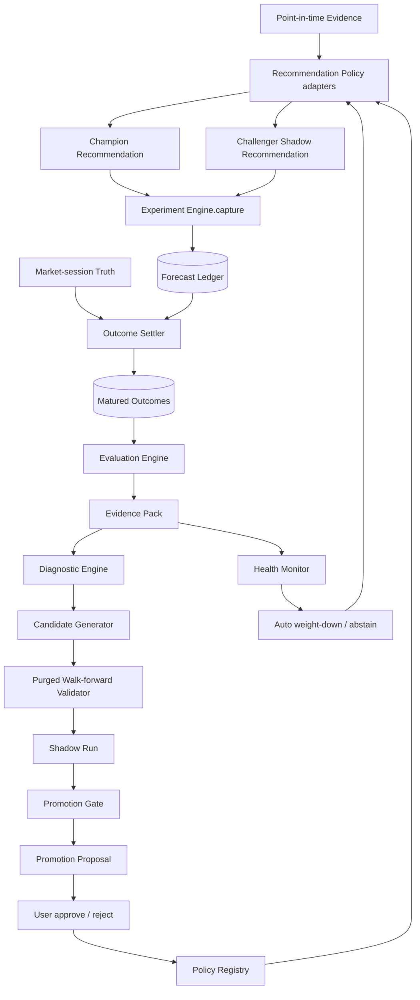

# AssetTrack 回測實驗與回饋校準模型開發計劃

狀態：In Progress（核心 modules 已完成；全 family 端到端閉環編排與人工治理操作待完成）

日期：2026-07-30

範圍：ETF、期權、類股、跨模型投資建議的歷史回放、真實預測追蹤、結果結算、
失效診斷、候選修正、再次驗證、升級與回滾。

## 1. 執行摘要

本計劃把使用者所稱的「回測模型」拆成兩個不可混淆的概念：

- **Recommendation Policy**：真正產生投資方向、機率、時間尺度與理由的規則或模型。
- **Experiment Engine**：負責保存預測、等待真實結果、評分、診斷失效、建立候選修正、
  再次驗證及提出升級／回滾建議的系統。

核心決策是：**Experiment Engine 可以自動記錄、結算、降權、暫停與產生候選提案，
但不得直接改寫 Recommendation Policy 的程式碼，也不得自動把未驗證的新邏輯升為正式版。**

完整回饋閉環如下：

1. 正式 Recommendation Policy 產生真實建議。
2. 系統把當時的結論、版本、參數、資料截止時間與證據寫入不可變更的 Forecast Record。
3. 預測期限成熟後，以預先定義的 Outcome Target 結算真實結果。
4. Evaluation Engine 同時評估方向、機率、相對基準超額、風險、覆蓋率與穩定性。
5. Diagnostic Engine 分辨資料故障、樣本不足、方向失效、時間尺度錯置、機率失準與
   regime drift，不把所有失敗都粗暴地解讀成「提高門檻」。
6. Candidate Generator 只能在白名單範圍內建立新的 Policy Version。
7. 新版本先做 purged walk-forward 歷史驗證，再進入不影響正式建議的 Shadow Run。
8. Challenger 在樣本外穩定優於 Champion 後才生成 Promotion Proposal。
9. 使用者確認後才升級；degraded Champion 依 D-02 保留方向並強制揭露限制，升級與永久
   回滾仍保留人工確認。
10. 新 Champion 繼續產生 Forecast Record，形成下一輪可稽核的回饋循環。

## 2. 目標與非目標

### 2.1 目標

- 驗證「當時真正發布的建議」，而不是事後用最新版邏輯重算一份較好看的歷史。
- 支援歷史 Replay 與未來 Shadow Run 兩種證據來源。
- 讓每次修正都有父版本、原因、證據、驗證窗口與回滾點。
- 能區分「資料壞掉」與「模型失效」，避免錯誤回饋污染 Recommendation Policy。
- 讓 ETF、期權、類股、跨模型使用相同的實驗生命週期與統計紀律。
- 保持離線優先：Experiment Engine 不直接打網路，只讀已持久化的 point-in-time 資料。
- 在證據不足時自動 abstain，禁止用捏造信心或預設前瞻期補空白。

### 2.2 非目標

- 不自動執行交易。
- 不讓程式自行改寫 Python 原始碼。
- 不因單次命中保留邏輯，也不因單次失誤修改邏輯。
- 不把描述「目前發生什麼」的 Observed Regime 當作未來預測。
- 不把沒有顯著優於基準誤寫成已證明失效。
- 不在現有 8～18 個資料日上宣稱已訓練完成可用的預測模型。
- 不把命中率當成唯一成功指標。

## 3. 不可變原則

1. **Point-in-time only**：決策只能讀取 `data_cutoff <= decision_at` 的資料。
2. **Forecast Record 不可變**：建議發出後不得覆寫；更正只能追加 Correction Event。
3. **Policy Version 不可變**：程式雜湊、特徵版本、參數及 scoring rule 任一改變都建立新版本。
4. **市場交易日對齊**：所有 horizon 以交易 session 計，不使用含週末的模糊日曆天。
5. **Outcome 事前定義**：每個 Policy Version 在產生預測前就固定 Outcome Target、
   benchmark、horizon 與 scoring rule。
6. **缺資料不是 miss**：無有效 entry／exit、公司行動未處理或資料品質不合格時標記 `VOID`。
7. **描述與預測分離**：Observed Regime 可持續顯示；Forward Forecast 未通過證據門檻時 abstain。
8. **調參與驗證分離**：用來挑 Candidate 的資料不得同時作 Promotion 的最終證據。
9. **同場比較**：Champion 與 Challenger 必須在相同 sessions、targets、成本與 scoring rule 下配對比較。
10. **Fail closed**：不確定時停止方向輸出，不以 fallback 補方向、信心、日期或價格。
11. **Promotion 人工確認**：系統可自動產生提案，不可自動升級新模型。
12. **安全降級可自動**：資料污染或 drift 明確時可自動降低權重或 abstain，避免壞模型繼續輸出方向。

## 4. 領域模型

### 4.1 核心實體

| 名稱 | 定義 | 主要責任 |
|---|---|---|
| Recommendation Policy | 從截至某一時點的 Evidence 產生 Recommendation Decision 的不可變邏輯版本 | 被回測與被比較 |
| Policy Version | Recommendation Policy 的程式、特徵、參數與 scoring rule 快照 | 稽核、比較、回滾 |
| Forecast Record | 某個 Policy Version 在某時點實際發出的不可變預測 | 真實 live 評分來源 |
| Outcome Target | 預測宣稱要解釋的標的、指數、投資組合或策略報酬 | 固定「預測對了什麼」 |
| Matured Outcome | horizon 到期後依固定 scoring rule 結算的真實結果 | 回饋證據 |
| Evaluation Run | 對一組 Forecast Record／Replay 決策執行的一次統計評估 | 產出 Evidence Pack |
| Champion | 目前正式對使用者產生方向建議的 Policy Version | 正式輸出 |
| Challenger | 在 Replay／Shadow Run 中與 Champion 同場比較、但不影響正式建議的 Policy Version | 候選修正 |
| Promotion Proposal | Challenger 達到升級門檻後產生、等待人工決定的提案 | 升級入口 |
| Model Health | 某 Policy Version 的 `warming_up / healthy / warning / degraded / disabled` 狀態 | 限制揭露、監控與修正提案 |

### 4.2 生命週期

Policy Version：

```text
DRAFT
  → REPLAYED
  → VALIDATED
  → SHADOW
  → PROPOSED
  → ACTIVE
  → RETIRED
        ↘ ROLLED_BACK
```

Forecast Record：

```text
OPEN → MATURED → SETTLED
   └────────────→ VOID
```

Promotion Proposal：

```text
PENDING → APPROVED → APPLIED
       ├→ REJECTED
       └→ EXPIRED
```

Model Health：

```text
WARMING_UP → HEALTHY → WARNING → DEGRADED → DISABLED
                  ↑          ↘ RETRAINING ↗
```

## 5. 系統骨架



### 5.1 外部 seam

`ExperimentEngine` 是 TUI、背景排程與測試共同使用的主要 seam。外部 interface 保持小：

```python
class ExperimentEngine:
    def capture(self, run: RecommendationRun) -> CaptureResult: ...
    def advance(self, as_of: datetime) -> ExperimentCycleReport: ...
    def report(self, query: ExperimentQuery) -> ExperimentReport: ...
    def decide(self, proposal_id: str, action: ReviewAction) -> PolicyState: ...
```

Interface 不暴露統計檢定、資料表、候選生成器或 drift 演算法。這些都是 implementation，
可以獨立替換而不迫使 TUI 或 Recommendation Policy 跟著改。

### 5.2 Recommendation Policy seam

ETF、期權、類股與跨模型是真正會出現多個 adapter 的 seam：

```python
class RecommendationPolicy(Protocol):
    family: PolicyFamily
    version: PolicyVersionId

    def evaluate(
        self,
        as_of_session: date,
        evidence: PointInTimeEvidence,
    ) -> tuple[RecommendationDecision, ...]: ...
```

預計提供：

- `ETFConsensusPolicyAdapter`
- `ETFSelectionTiltPolicyAdapter`
- `OptionsForecastPolicyAdapter`
- `SectorFlowPolicyAdapter`
- `SectorPredictivePolicyAdapter`
- `CrossModelPolicyAdapter`

現有 `compute_symbol_trends`、`compute_directional_verdicts`、`detect_broad_flow`、
`synthesize_cross_model` 留在各自 implementation；adapter 只負責把輸入／輸出轉成共同契約，
不複製判斷公式。

### 5.3 內部 modules

| Module | Interface | Implementation 隱藏的複雜度 |
|---|---|---|
| `experiment_engine` | `capture / advance / report / decide` | 協調所有流程、冪等與狀態轉換 |
| `policy_registry` | `resolve / register / activate / retire` | Policy Version、父子關係、code hash、使用者 assignment |
| `forecast_ledger` | `append / mature / query` | 不可變寫入、重複去除、Correction Event |
| `outcome_settlement` | `settle(records, as_of)` | session 對齊、entry/exit、benchmark、VOID 原因 |
| `evaluation` | `evaluate(request)` | proper scores、超額、風險、block bootstrap、多重比較 |
| `diagnostics` | `diagnose(evidence_pack)` | 失效類型、受影響 slice、可採取動作 |
| `candidate_generation` | `propose(diagnostic, budget)` | 白名單參數、單步變更、候選數上限 |
| `walk_forward_validation` | `validate(candidate, protocol)` | purge、embargo、rolling fold、negative control |
| `health_monitor` | `update(outcomes)` | prequential loss、drift、warning/degraded |
| `promotion` | `review(champion, challenger)` | 升級門檻、非劣性、安全限制、提案證據 |

### 5.4 依賴分類與 adapter

- **In-process**：評分、統計、診斷、候選生成與 Promotion Gate。直接透過 module interface 測試。
- **Local-substitutable**：SQLite Forecast Ledger、point-in-time snapshot store。
  正式環境用 SQLite／本機快照 adapter，測試使用 in-memory SQLite／fixture adapter。
- **True external**：行情供應商不進入 Experiment Engine；既有背景抓取先把資料持久化，
  Experiment Engine 只讀本機已確認的 session truth，維持離線與可重現。

## 6. 資料契約

### 6.1 Policy Version

建議欄位：

```text
policy_version_id
family
name
parent_version_id
code_hash
feature_schema_version
parameter_schema_version
parameters_json
outcome_spec_json
created_at
created_reason
status
```

規則：

- `code_hash + feature_schema_version + parameters_json + outcome_spec_json` 決定版本身分。
- 已存在版本不得更新內容，只可改狀態。
- 自動候選必須有 `parent_version_id` 與 `created_reason`。
- 手工改公式也必須登記為新版本，不能沿用舊 ID。

### 6.2 Forecast Record

```text
forecast_id
user_id
policy_version_id
mode                  # champion / shadow / replay
family
target_kind
target_id
as_of_session
entry_session         # 明確凍結進場 session；不得事後依 emitted_at 猜測
emitted_at
data_cutoff
horizon_sessions
maturity_session
direction             # up / down / abstain
probability_up
expected_return
expected_quantiles_json
benchmark_id
decision_thresholds_json
observed_regime
data_quality
evidence_hash
rationale_ref
created_at
```

必要 invariant：

- `data_cutoff <= emitted_at`。
- `entry_session >= as_of_session`。
- `maturity_session` 從 `entry_session` 往後移動固定交易 sessions，且必須大於
  `entry_session`。
- `(user, policy_version, target, as_of_session, horizon, mode)` 唯一。
- `abstain` 仍需記錄，用來評估 coverage 與 missed opportunity，但不算方向 miss。
- Record 不可 update；資料更正寫入 `forecast_corrections`，原紀錄保留。

### 6.3 Matured Outcome

```text
outcome_id
forecast_id
entry_session
exit_session
entry_price_adjusted
exit_price_adjusted
asset_return
benchmark_return
signed_return
excess_signed_return
cost_adjusted_return
hit
maximum_favorable_excursion
maximum_adverse_excursion
truth_source
truth_quality
settled_at
void_reason
```

共同公式：

```text
direction_sign = +1 for up, -1 for down
signed_return = direction_sign × asset_return
excess_signed_return = direction_sign × (asset_return - benchmark_return)
hit = signed_return > neutral_move_threshold
```

`neutral_move_threshold` 必須在 Outcome Spec 事前固定，避免把 ±0.01% 雜訊算成成功或失敗。

### 6.4 Evaluation Run

```text
evaluation_id
protocol_version
champion_version_id
challenger_version_id
window_start
window_end
folds_json
purge_sessions
embargo_sessions
target_filter
primary_metric
metrics_json
statistical_evidence_json
data_quality_summary_json
created_at
```

### 6.5 Promotion Proposal

```text
proposal_id
family
champion_version_id
challenger_version_id
evaluation_id
affected_scope
benefits_json
regressions_json
risks_json
recommended_action
status
created_at
reviewed_at
reviewed_by
```

### 6.6 儲存位置

第一版建議在既有每位使用者的 `data/<user>_assettrack.db` 增加 experiment tables，
市場快照仍留在現有共用 cache：

- Recommendation Policy 的程式定義可共用。
- Champion assignment、Forecast Record、Outcome 與 Promotion Decision 按使用者隔離。
- SQLite 新增 `schema_migrations`，所有建表／欄位改動需可重入、可回滾。
- 不把 Forecast Ledger 放回 JSON；多狀態、關聯與查詢需求已超出 JSON 適用範圍。

## 7. 不同投資建議的 Outcome Target

### 7.1 ETF 個股共識

- Target：該共識個股的 adjusted close。
- Entry：決策 session 收盤；若決策在收盤前，使用下一個完整 session 收盤。
- Benchmark：預先指定的 sector ETF；缺 sector mapping 時使用 QQQ 或 SPY。
- 主要指標：benchmark-adjusted signed return。
- 必須凍結當時參與共識的 ETF universe，禁止用今天仍存活的基金回看歷史。

### 7.2 ETF 每日主動選股多空

- Target：決策當時持有宇集的凍結市場代理。
- Universe：以決策當時有真實價格的 symbols 固定，不隨未來新增／刪除。
- 權重：第一版使用等權中位數；若改市值權重，必須保存 point-in-time 權重。
- Benchmark：QQQ／SPY。
- 不得用「未來仍有價格資料的 symbols」反向決定當時 universe。

### 7.3 期權方向預測

- Direction Target：標的股票 adjusted close，不直接用單張 option `lastPrice` 判定方向成功。
- Probability Target：每個固定 horizon 的 `P(return < 0)` 或 `P(return > 0)`。
- Strategy Target：如另產生 put spread／collar 建議，獨立結算真實可成交組合 P&L，
  不得拿方向正確替代策略獲利。
- 期權資料必須先符合 session、midpoint、spread、OI 時點與 surface quality 規則。
- 詳細 feature 重設沿用
  [`options_model_redesign_research.md`](./options_model_redesign_research.md)。

### 7.4 類股共識

- Target：使用決策當時成分股凍結建立的類股 proxy。
- 權重：有完整 point-in-time FX／market cap 時用 USD 市值權重，否則等權並記錄降級。
- Benchmark：SPY／QQQ 或 sector benchmark。
- Observed Regime 與 Forward Forecast 分開；「今天已普跌」本身不算預測命中。

### 7.5 跨模型總結

- 所有投票 Policy 必須對齊相同 horizon 與可比較 Outcome Target。
- 若 ETF、期權、類股實際預測不同標的，不得只因都有 up/down 就直接合成同一準確率。
- 第一版建議把跨模型 Target 明確定為使用者投資組合、QQQ 或 SPY 三者之一。
- 跨模型權重只讀各 Policy 的樣本外 proper score／excess return，不讀訓練內命中率。
- 無共同成熟 horizon 時直接 abstain。

### 7.6 總經與事件

- Observed macro result 保持描述性 evidence，不強迫投方向票。
- 若日後加入事件預測，必須建立獨立 Recommendation Policy、Outcome Target 與版本，
  不可沿用現在的事件謹慎度提示冒充預測。

## 8. 評分體系

### 8.1 方向品質

- Direction hit rate。
- Baseline hit rate。
- Edge：`hit rate - baseline hit rate`。
- Up／down 分方向評估，禁止以樣本較多方向掩蓋另一方向失效。
- 各 horizon 固定報告，不以同一資料挑最好看的 horizon 當正式結果。

### 8.2 機率品質

當 Recommendation Policy 輸出機率時，以 proper scores 為主：

- Brier score。
- Brier skill score，相對 rolling base-rate benchmark。
- Log loss。
- Calibration intercept／slope。
- Reliability bins。
- Expected Calibration Error 作顯示輔助，不單獨作 Promotion 依據。

`1 - p_value` 不得再命名為 prediction confidence；p-value 是統計證據，不是漲跌機率。

### 8.3 經濟價值

- Signed return。
- Benchmark-adjusted signed return。
- Cost-adjusted return。
- Profit factor／average win／average loss。
- 若輸出可執行策略，再納入 bid/ask、滑價、commission、資金占用與最大損失。

### 8.4 風險

- Maximum Adverse Excursion。
- Maximum Favorable Excursion。
- 最大 drawdown。
- Tail loss／worst decile。
- 高信心預測的錯誤損失。

### 8.5 覆蓋與可用性

- Direction coverage。
- Abstain rate。
- VOID rate 與原因。
- Data-quality coverage。
- 每個 family／target／direction／horizon 的成熟樣本數與 distinct sessions。

### 8.6 穩定性

- 時間前後區間。
- Bull／bear／range regime。
- 高／低波動。
- Earnings／macro event 前後。
- Target／sector／direction。
- Champion 與 Challenger 配對差異。

### 8.7 統計方法

- 保留現有 Wilson／binomial 作直觀顯示與小樣本警示。
- Promotion 主檢定改為按 signal session cluster 的 block bootstrap 或 paired permutation，
  處理同日跨標的相關與重疊 horizon。
- 參數搜尋與多個 Challenger 納入多重比較校正。
- 重複 Promotion cycle 納入 sequential testing／cooldown，避免每週重抽直到過關。
- 最低樣本由 power analysis 決定；初始工程 guardrail 為 `ESS >= 30` 且至少兩個時間 folds。
- 30／60-session horizon 若受資料長度限制達不到 guardrail，只能維持 research／warming-up。

## 9. Walk-forward 與防偏誤協議

### 9.1 時序切分

禁止 random split。每個 Evaluation Run 使用 rolling folds：

```text
Train ── Purge(max_horizon) ── Validation ── Embargo ── Next fold
```

- Train：只用來選 Candidate 參數或估計係數。
- Purge：移除標籤 horizon 與 Validation 重疊的 Train records。
- Validation：完全不參與 Candidate 選擇。
- Embargo：防止相鄰 market state 泄漏。
- Live Shadow：最終 forward-only 證據，任何歷史調參都不可回寫。

### 9.2 防偏誤清單

- Point-in-time universe，防 survivorship bias。
- 凍結當時 benchmark、類股成分與 ETF 參與集合。
- 公司行動使用 adjusted close 或明確 corporate-action adapter。
- 特徵 normalization 只能 fit 在 Train 以前。
- 資料修訂保存 observed-at，不以今天修訂後的值冒充當時已知值。
- 不以 Outcome 資料決定是否保留 Forecast Record。
- 不以最高命中率挑 horizon。
- 不在看到測試結果後無限增加新 Candidate；每輪有 mutation budget。
- Negative control 必須隨 Evaluation Run 執行，確認框架沒有製造假 edge。

## 10. 回饋、修正與再次驗證

### 10.1 一次完整 Experiment Cycle

1. `capture`：保存 Champion／Challenger 當日 Recommendation Decision。
2. `mature`：找出 maturity session 已到的 OPEN records。
3. `settle`：以固定 Outcome Spec 結算；不合格資料標 VOID。
4. `score`：更新方向、proper score、超額、風險與 coverage。
5. `monitor`：更新 prequential loss 與 Model Health。
6. `diagnose`：建立 Failure Diagnostic。
7. `generate`：若證據足夠，依 mutation budget 建立 Challenger。
8. `replay`：用 purged walk-forward 跑歷史候選比較。
9. `shadow`：候選通過 Validation 後進入 live Shadow。
10. `promote`：達門檻才建立 Promotion Proposal。
11. `review`：使用者 approve／reject。
12. `observe again`：新 Champion 從下一個完整 session 開始記錄新版本預測。

### 10.2 失效分類與系統回饋

| 觀察 | Failure Class | 系統回饋 | 可以產生的修正 | 禁止動作 |
|---|---|---|---|---|
| 快照過期、session 混亂、價格缺失 | `DATA_QUALITY` | VOID、告警、暫停該 adapter | 修資料收集／quality gate | 調整方向門檻 |
| 樣本未成熟或 ESS 太低 | `UNDERPOWERED` | 維持 warming-up | 延長收集、縮小正式 horizon 集合 | 宣稱失效或有效 |
| 命中率高但不優於市場基準 | `NO_INCREMENTAL_EDGE` | 降低權重或 abstain | benchmark-aware feature／scope | 只因裸命中率保留 |
| Edge 的信賴區間明確低於 0 | `NEGATIVE_EDGE` | degraded Warning Mode、方向附限制 | 收緊、停用、相反假說作獨立 Candidate | 原地翻轉方向或隱藏限制 |
| Up 有效、down 失效 | `DIRECTION_ASYMMETRY` | 壞方向 abstain | direction-specific threshold／policy | 用合併 n 掩蓋 |
| 1-session 有效、20-session 失效 | `HORIZON_MISMATCH` | 限制有效 horizon | horizon-specific Candidate | 動態挑最好看 horizon |
| 機率過度自信但方向尚可 | `MISCALIBRATION` | 降信心、保留方向觀察 | Platt／isotonic／shrinkage Challenger | 把 p-value 當機率 |
| 特定 regime 才失效 | `REGIME_DRIFT` | 該 regime abstain／降權 | regime-aware Candidate | 全域改一組門檻 |
| 方向正確但策略仍虧損 | `STRATEGY_MAPPING` | 停止策略建議 | 成本、IV、spread、風險 mapping 修正 | 修改方向模型掩蓋 |
| Challenger 穩定優於 Champion | `PROMOTION_READY` | 生成提案 | 升級新版本 | 自動啟用 |
| Champion live loss 顯著惡化 | `CHAMPION_DEGRADED` | 保留方向並醒目揭露近期失配 | 重訓／回滾提案 | 無限制地當成 healthy 輸出 |

### 10.3 Candidate mutation budget

自動 Candidate 只能修改白名單參數：

- 每個 cycle 每個 family 最多 3 個 Candidate。
- 每個 Candidate 原則上只改 1 個主參數一步。
- 同一參數在 cooldown 期間不得反覆來回。
- Candidate 必須帶 hypothesis，例如「提高 ETF consensus threshold 可降低 false positive」。
- 涉及新 feature、公式、target 或資料源的修改必須人工開發成新 Policy Version，
  不屬於自動調參。

建議白名單：

| Family | 可自動候選 | 必須人工開發 |
|---|---|---|
| ETF | consensus threshold、minimum funds、tilt threshold | 新持股來源、新 share inference、新 target、**window（D-11）** |
| Options | probability threshold、quality threshold、固定 horizon 啟停 | IV surface feature、新機率模型、signed flow |
| Sector | breadth／z／persistence threshold、stress ratio | 新 universe、新 FX／market-cap 方法 |
| Cross-model | neutral band、已驗證 score-based weight cap | 新 Outcome Target、新 family 投票 |

### 10.4 Promotion Gate

Challenger 必須全部符合：

1. Data-quality 與 leakage tests 全過。
2. 至少兩個時間 Validation folds。
3. 最低 `ESS >= 30`；實際門檻若 power analysis 更高則取較高者。
4. Live Shadow 累積預定最低成熟 outcomes。
5. 主要指標在配對比較中優於 Champion，且信賴區間下界高於最小實用改善值。
6. 風險指標不劣於非劣性門檻。
7. Coverage 不可因過度 abstain 而崩落。
8. Up／down／主要 regime 不得有重大 slice regression。
9. 通過多重比較與 negative control。
10. 有清楚的父版本、變更內容、理由、證據與 rollback target。
11. 使用者確認。

「未顯著優於 Champion」的正確結果是維持 Champion，不是修改到下一個參數再試到過關。

### 10.5 Health Monitor 與安全降級

初始 guardrail：

- 連續 3 次高機率成熟預測錯誤：`warning`，信心權重減半，但不立刻重訓。
- Prequential proper score 持續劣於 base-rate benchmark，且 drift test 告警：
  `degraded`，進入 Warning Mode；原方向只有在既有證據門檻本身通過時才繼續顯示，並強制
  附上近期失配、樣本範圍與「不可單獨作為投資決策」。
- Data-quality coverage 低於門檻：停用受影響 adapter，不處罰 Policy。
- Challenger 不得因 Champion degraded 而跳過 Validation；Warning Mode 不會讓 Challenger
  自動接手。
- 回滾或套用校準提案仍由使用者確認。

D-02 已確認採 B「Warning Mode」，產品行為固定如下：

- degraded 是限制狀態，不是永久失效判決，也不是低信心訊號的通行證。只有原本方向、
  樣本與信心門檻均已通過時才保留方向；資料不足或本來未過門檻仍必須 abstain。
- 每筆受影響輸出都要同時顯示 `DEGRADED`、實際近期失配原因、可信度受限，以及
  「不可單獨作為投資決策」；不得只把限制藏在次要頁面。
- Cross-model 可保留該方向作為帶限制的輸入，但不得把 degraded family 描述成 healthy，
  也不得僅靠該輸入產生高可信度總結；自動 weight cap 是否啟用須另立決策。
- 使用者既有持倉不會被交易、賣出或調整；系統也不會自動反轉方向。
- Champion 繼續記錄 Forecast／Outcome，讓新 Matured Outcomes 能更新健康狀態。
- 系統可以建立受 mutation budget 限制的 Candidate Proposal，但不能自動套用；未驗證的
  Challenger 不會因 Champion degraded 而接管正式輸出。
- Health status 可隨新證據按版本化 Health Protocol 恢復；Promotion、Candidate 套用與永久
  rollback 仍一律需要使用者確認。

## 11. 排程與事件

### 11.1 每個完整美股 session 收盤後

- 完成行情／快照寫入。
- 結算到期 Forecast Records。
- 更新 Health Monitor。
- 產生下一 session 的 Champion／Shadow decisions。
- 寫入 Forecast Ledger。

### 11.2 每次有新 Matured Outcome

- 更新 prequential metrics。
- 檢查 warning／degraded。
- 不必等固定雙週才發現明顯失效。

### 11.3 每週

- 只有在「新增成熟有效樣本」達門檻時才建立 Evaluation Run。
- 樣本沒有增加時，不更新 `last_outcome_evaluated`，也不假裝完成新校準。

### 11.4 候選訓練／Promotion

- 依最低新樣本數與 cooldown 觸發，不使用單純日曆 7／14 天。
- 分開記錄：
  - `last_outcome_evaluated`
  - `last_drift_check`
  - `last_challenger_trained`
  - `last_shadow_started`
  - `last_model_promoted`

### 11.5 冪等與復原

- 同一 session 重跑不得新增重複 Forecast Record 或 Outcome。
- 應用啟動時可補做尚未結算的成熟 outcomes。
- 任一步驟失敗不回滾已完成的不可變紀錄；下次從 checkpoint 繼續。
- SQLite write 使用 transaction，背景 worker 同一 user 只允許一個 cycle lock。

## 12. Test Mode／策略實驗室畫面

### 12.1 總覽

每個 family 顯示：

- Champion version。
- Model Health。
- 正式方向是否啟用／abstain。
- 已成熟／待成熟／VOID 數。
- 最近一次 Evaluation。
- 目前 Challenger 與 Shadow 進度。
- 待確認 Promotion／Rollback Proposal。

### 12.2 Forecast Ledger

- 日期、target、horizon、方向、機率、Policy Version。
- 當時 data cutoff、quality 與 evidence hash。
- OPEN／MATURED／SETTLED／VOID。
- 不允許編輯原紀錄。

### 12.3 Outcome 明細

- Asset／benchmark return。
- Signed／excess／cost-adjusted return。
- Hit、MFE、MAE。
- VOID 原因。
- 可依 family、target、direction、horizon、regime 篩選。

### 12.4 Champion vs Challenger

- 相同 sessions 的 paired comparison。
- Primary／risk／coverage metrics。
- Confidence interval 與 power。
- 哪些 slices 進步、哪些退步。
- Shadow 還缺多少成熟 outcomes。

### 12.5 人工操作

- Approve promotion。
- Reject proposal。
- Request more shadow data。
- Pause policy。
- Approve rollback。

所有按鈕操作都產生 Policy Event，不直接修改歷史紀錄。

## 13. 測試策略

### 13.1 Interface tests

主要測試面是 `ExperimentEngine` interface：

- Capture 同一決策兩次仍只有一筆。
- Advance 只結算 maturity 已到的 records。
- Report 不因 implementation 重構改變可觀察結果。
- Decide 不能跳過合法狀態轉換。

### 13.2 不可變與時序測試

- 修改未來資料不得改變 T 日 Recommendation Decision。
- Forecast Record insert 後不可 update。
- Correction Event 不刪除原值。
- Policy Version 內容改變一定產生新 ID。
- Horizon 使用交易 session，不把週末算一天。
- 長 horizon Train label 與 Validation 重疊時必須 purge。

### 13.3 Outcome tests

- adjusted close／benchmark／neutral threshold 計算。
- Up／down signed return 對稱。
- 缺 entry、缺 exit、異常公司行動標 VOID，不算 miss。
- Sector／ETF universe 在 decision time 凍結。
- Options 方向與策略 P&L 分開。

### 13.4 統計與 false-positive tests

- 純隨機資料的 false-positive rate 不超過設定門檻。
- 植入已知 edge 能在足夠 power 下被檢出。
- 樣本不足時不得 promotion。
- 同日多標的不能倍增獨立證據。
- Challenger 與 Champion 使用 paired sessions。
- 多 Candidate 校正後才能通過。
- Horizon shopping 不能改變正式 primary horizon。

### 13.5 Feedback tests

- DATA_QUALITY 只修資料，不調 Policy。
- UNDERPOWERED 不產生失效結論。
- NEGATIVE_EDGE 進 degraded Warning Mode；原本未通過證據門檻的方向仍然 abstain。
- DIRECTION_ASYMMETRY 只影響壞方向。
- Promotion 永遠需要 approve。
- Champion degraded 不得讓未驗證 Challenger 自動接手。
- Rollback 回到指定的最後 healthy version。

### 13.6 Adapter 與 TUI tests

- 六個 Recommendation Policy adapters 的 contract tests。
- In-memory SQLite 端對端 cycle。
- Schema migration 可重跑。
- Test Mode 畫面 headless mount、filter、approve／reject／rollback。
- 背景 cycle 中斷後重新啟動可續跑。

### 13.7 開發環境

- 把 `pytest`、coverage 與必要測試工具加入 dev optional dependencies。
- CI／本機標準命令固定，不再依賴手工執行 pytest-style assertions。
- 每個 work package 都要先有失敗測試，再實作到通過。

## 14. 遷移與相容策略

1. 把目前生效參數登記為各 family 的 `v1` Champion。
2. 現有歷史 snapshot 只用於 Replay，不冒充過去真實發布的 Forecast Record。
3. Forecast Ledger 從功能上線後 forward-only 累積。
4. 現有 `*_calibration.json` 先維持唯讀相容；active params 遷移成功後才停止寫入。
5. 第一階段雙軌：現有回測畫面繼續顯示，新 Test Mode 只讀新 ledger。
6. 新 Evaluation 與舊 `backtest_stats` 對同一合成 fixture 做 parity check。
7. 所有 Promotion／Rollback 都可回到上一個 Policy Version，不刪除舊資料。
8. 不刪除現有 ETF／options／sector history。

## 15. 工作包與依賴

### WP-00：決策凍結與契約

工作：

- 確認跨模型 Outcome Target。
- 確認 horizon 全改交易 sessions。
- 確認 Promotion 人工、degraded 採 Warning Mode 並強制揭露限制。
- 確認 global Policy Definition／per-user Champion assignment。
- 凍結 Forecast Record、Outcome、Policy Version schema。
- 建立 ADR：為何採不可變 Forecast Ledger 與 Champion–Challenger。

驗收：

- 本文件的「待決策」全部有結論。
- schema 與狀態機 review 通過。
- 無任何 family 仍把 nowcast 當 forecast。

依賴：無。

預估：1～2 工作天。

### WP-01：Experiment 儲存基礎

工作：

- SQLite migrations。
- `policy_versions`、`policy_assignments`、`forecast_records`、
  `forecast_corrections`、`outcomes`、`evaluation_runs`、
  `promotion_proposals`、`policy_events`。
- Repository implementation 與 in-memory test adapter。
- 唯一鍵、foreign key、transaction、cycle lock。

驗收：

- migration 可連續執行兩次。
- 不可變資料無 update 路徑。
- 重複 capture／settle 冪等。
- per-user 資料隔離測試通過。

依賴：WP-00。

預估：3～5 工作天。

### WP-02：Policy Registry 與 adapters

工作：

- 建立 Recommendation Policy interface。
- 封裝 ETF consensus、ETF tilt、options、sector、cross-model adapters。
- 計算 code／feature／parameter／outcome hash。
- 將現有 active params 登記為 v1。

驗收：

- 同一 Evidence 與版本輸出 deterministic。
- 每個 adapter 只呼叫既有唯一判斷函式。
- 任何參數或 outcome spec 改變都得到不同 version ID。

依賴：WP-00、WP-01。

預估：4～6 工作天。

### WP-03：Forecast Ledger capture

工作：

- Dashboard／分析頁共用 Recommendation Run。
- Champion 與 Shadow 一次計算、分別寫入。
- 保存 data cutoff、evidence hash、quality、rationale reference。
- OPEN／VOID 初始狀態。

驗收：

- 畫面重繪不重複寫 record。
- 無證據方向記 abstain，不捏造 horizon。
- 改變未來資料不改變已寫 Forecast Record。

依賴：WP-01、WP-02。

預估：3～5 工作天。

### WP-04：Outcome Settlement

工作：

- Market-session calendar。
- 各 family Outcome Target adapters。
- adjusted entry／exit、benchmark、signed／excess、MFE／MAE。
- VOID taxonomy。
- 啟動 catch-up 與 daily advance。

驗收：

- 週末／假日／缺資料／公司行動 fixture 全過。
- Up／down 對稱。
- 相同 record 只結算一次。
- 方向與 options strategy P&L 分表評估。

依賴：WP-01、WP-03。

預估：4～7 工作天。

### WP-05：Evaluation Engine

工作：

- 方向、proper score、經濟、風險、coverage、slice metrics。
- Clustered block bootstrap／paired comparison。
- Power、ESS、多重比較與 negative controls。
- Evidence Pack。
- 舊 `backtest_stats` 相容顯示。

驗收：

- 純雜訊不產生 Promotion。
- 已知 edge 在足夠 power 下可被偵測。
- 同日跨標的不增加獨立樣本。
- 結果可由 evaluation ID 完整重現。

依賴：WP-04。

預估：5～8 工作天。

### WP-06：Replay 與 Purged Walk-forward

工作：

- Point-in-time dataset builder。
- Rolling folds、purge、embargo。
- Point-in-time universe 凍結。
- Candidate／Validation 資料隔離。
- Replay report。

驗收：

- 未來資料 mutation test 全過。
- 長 horizon label 不跨 fold。
- 同版本、同 protocol、同資料 hash 得到同結果。

依賴：WP-02、WP-05。

預估：5～8 工作天。

### WP-07：Diagnostic 與 Candidate Generator

工作：

- Failure Classifier。
- Slice 診斷。
- 白名單參數與 mutation budget。
- hypothesis、父版本、cooldown。
- Options 與公式變更只能人工建立版本。

驗收：

- 資料故障不觸發調參。
- 無 power 不觸發調參。
- direction／horizon／regime 問題產生對應範圍 Candidate。
- 每 cycle 候選數與變更幅度受限。

依賴：WP-05、WP-06。

預估：4～6 工作天。

### WP-08：Health Monitor、Shadow 與 Promotion

工作：

- Prequential loss。
- Warning／degraded Warning Mode／資料不足 abstain。
- Shadow progress。
- Promotion Gate 與 Evidence Pack。
- approve／reject／request-more-data／rollback。

驗收：

- degraded Champion 保留原本已合格方向並強制顯示限制。
- Challenger 無法繞過 Validation。
- Promotion 無 approve 不生效。
- Rollback 回到最後 healthy version 並留下 Policy Event。

依賴：WP-05、WP-06、WP-07。

預估：5～8 工作天。

### WP-09：Test Mode TUI

工作：

- 策略實驗室總覽。
- Forecast Ledger／Outcome／Champion vs Challenger／Proposal views。
- Filter、Evaluation／Diagnostic evidence、approve／reject／rollback。
- 狀態與樣本不足文案。

驗收：

- Headless TUI tests。
- 畫面與資料庫狀態一致。
- 所有 destructive state change 有確認。
- 無證據時只顯示 warming-up／abstain。

依賴：WP-03、WP-04、WP-08。

預估：4～6 工作天。

### WP-10：分 family 強化

ETF：

- point-in-time ETF universe。
- source freshness 與官方持股 adapter。
- consensus／tilt Outcome Spec。

Sector：

- point-in-time members、FX／market-cap truth。
- Observed Regime／Forecast 分流。

Options：

- session cleanup、midpoint、quote quality。
- 固定 delta／tenor IV surface features。
- probability model、strategy mapping 分離。
- 詳細順序依 options redesign research。

Cross-model：

- 固定 Outcome Target。
- 只使用樣本外 reliability。
- common horizon／target guard。

驗收：

- 每個 family 都通過 Recommendation Policy contract。
- 每個 family 都有至少一個 negative control。
- Options 在資料不足期間只顯示 Observed Regime，Forward Forecast abstain。

依賴：WP-02～WP-08。

預估：ETF／Sector／Cross-model 6～10 工作天；Options 另 10～15 工作天。

### WP-11：遷移、觀測與發布

工作：

- v1 Champion import。
- 雙軌 parity。
- DB backup／migration rollback。
- cycle logs、health alerts、performance budget。
- 使用者驗證 checklist。

驗收：

- 既有功能與歷史資料不被刪除。
- 升級前後 Forecast Record 可追溯。
- 重新啟動、離線、缺資料、部分 adapter 失敗均可恢復。
- 完整 regression suite 通過。

依賴：全部前置 WP。

預估：4～6 工作天。

## 16. 建議發布階段

### Phase A：可稽核 MVP

包含 WP-00～WP-04：

- Policy Version。
- Forecast Ledger。
- 真實 outcome 結算。
- 唯讀 Test Mode 基礎頁。

價值：先停止「只重算歷史、不知道當時真的說過什麼」的問題。

單一開發者累積預估：3～5 週。

### Phase B：可信評估

包含 WP-05～WP-06：

- proper scores。
- 經濟／風險指標。
- purged walk-forward。
- false-positive controls。

價值：可以分辨命中、基準漂移與真正 edge。

單一開發者累積預估：5～8 週。

### Phase C：回饋修正閉環

包含 WP-07～WP-09：

- 診斷。
- Candidate。
- Shadow。
- Promotion／Rollback。
- 完整 Test Mode。

價值：完成「失效 → 修正 → 再驗證 → 人工升級」。

單一開發者累積預估：8～12 週。

### Phase D：全 family 生產化

包含 WP-10～WP-11：

- ETF／Sector／Options／Cross-model 全面接線。
- Options feature／probability 模型重設。
- 遷移、效能與發布。

價值：所有投資建議使用相同實驗紀律。

單一開發者總預估：12～19 週，不含真實資料累積等待；若先不做 Options
surface／probability model 重設，可縮短至約 9～14 週。

## 17. 資料成熟期

工程完成不等於模型立刻可信：

- 1-session horizon：仍需至少數十個 distinct sessions。
- 5-session horizon：重疊標籤使有效樣本增加較慢。
- 使用者已決定研究快照與 exact-session truth 保存 2 年，約可涵蓋 500 個美股 sessions。
- 在目前至少 30 effective blocks 且 block length 等於 horizon 的 guardrail 下，理論上
  1／5／10／14-session 約可取得 500／100／50／35 blocks；20／30／60-session 約只有
  25／16／8 blocks，因此後三者維持 `warming_up / research_only`，不得參與 Promotion。
- 14-session 只是理論上接近可推論，仍須扣除 VOID、資料缺口與方向 slice；實際是否有 power
  以 Evidence Pack 為準，不因保存期達兩年自動取得資格。
- Options 依現有研究結論需至少 6～12 個月乾淨 EOD surface 才開始比較機率模型，
  正式 Promotion 可能需要更久。

因此發布時要同時呈現：

- 工程狀態：功能是否可用。
- 資料狀態：多少 matured outcomes。
- 統計狀態：是否有 power。
- Model Health：是否允許方向輸出。

四者不得合併成一個模糊的「準確率」。

## 18. 決策狀態

截至 2026-08-02 已確認的決策與仍待確認項目：

1. **跨模型 Outcome Target（已確認）**：QQQ。
2. **時間尺度（採既定安全預設）**：全部使用美股交易 sessions。
3. **安全自動化（已確認）**：degraded 採 Warning Mode，方向繼續顯示但強制揭露近期失配與
   不可單獨採用限制；Promotion／Rollback 維持人工。
4. **Policy scope（已確認）**：程式定義全域共用，Champion assignment 與 Forecast Ledger
   按使用者隔離。
5. **長期資料（已確認）**：研究快照與 outcome truth 保存 2 年；20／30／60-session 在目前
   guardrail 下維持 research-only。
6. **主要 Promotion 指標（已確認）**：probability policy 使用 Brier skill；direction-only
   policy 使用 benchmark-adjusted signed return。
7. **最低改善值（已確認）**：採方案 B；probability policy 統一要求至少 `0.0200` Brier
   skill 改善，direction-only policy 統一要求至少 `0.0020` benchmark-adjusted signed-return
   改善。Replay 與 Shadow 的信賴區間下限都必須越過相同門檻。
8. **Candidate 自動提案（已確認）**：只允許白名單數值門檻、單步小改與每輪有限候選；
   不得自動套用。
9. **Options 歷史資料（採安全實作預設）**：目前採 forward-only；若日後購買可信的
   point-in-time surface，必須建立新 feature／evaluation protocol，不得以今天的 option
   universe 假造過去。

### 18.1 使用者決策登錄表

下列選項會改變產品語意、風險權限、成本或 Promotion 判定，不能由實作端悄悄決定。
在使用者確認前可依推薦值建立版本化 interface／測試，但不得啟用對正式 Policy 的變更。

| ID | 事項 | 決定／推薦 | 狀態 |
|---|---|---|---|
| D-01 | Cross-model 固定 Outcome Target | QQQ | 已確認 |
| D-02 | degraded 時是否自動停止方向輸出 | B：Warning Mode，方向續顯示並強制揭露限制 | 已確認並套用既有 Options 顯示 |
| D-03 | Policy scope | Definition 全域；assignment／Ledger per-user | 已確認 |
| D-04 | 研究與 truth 保存期 | 2 年；20／30／60-session research-only | 已確認並已套用 retention |
| D-05 | 主要 Promotion 指標 | probability：Brier skill；direction-only：benchmark-adjusted signed return | 已確認 |
| D-06 | Promotion 最低實用改善幅度 | 方案 B：probability `0.0200` Brier skill；direction-only `0.0020` benchmark-adjusted signed return | 已確認並完成；profile `promotion-minimum-improvement-b-v1` |
| D-07 | Candidate mutation budget | 白名單數值門檻、每次一個主參數一步、每 family 每 cycle 最多 3 個 | 已確認並完成 |
| D-08 | Options 歷史資料來源 | forward-only；有可信 point-in-time surface 才能另開歷史 Replay | 已採安全實作預設 |
| D-09 | hit 判定死區與來回交易成本 | `neutral_move_threshold = 0.0025`（25 bps）；`round_trip_cost_bps = 10.0` | 已確認並完成（bug#00126） |
| D-10 | 前瞻期 | ETF consensus／ETF tilt／Options／Cross-model 固定階梯 `(1, 5, 10)`，horizon 屬於 Decision 而非 Policy Version | 已確認並完成（bug#00127） |
| D-11 | 特徵窗口是否可自動調 | 否。`window_days` / `lookback` 只能人工開發新版本——window 同時改變判斷輸入量與訊號頻率，且與 replay 的 purge 長度耦合 | 已確認（bug#00130） |
| D-12 | legacy 校準（按鍵 `k`）定位 | 改為唯讀；門檻變更單一化到 Experiment 的 Candidate → Replay → Shadow → Promotion Proposal | 已確認並完成（bug#00129） |
| D-13 | 補齊四個缺口參數 | 核准新增 `directional_horizons`／`direction_gate`／`probability_shrinkage`／`regime_gate`，讓 `horizon_mismatch`／`direction_asymmetry`／`miscalibration`／`regime_drift` 有旋鈕可轉；依分段計劃排在 **O-6** | 已核准，待實作 |

目前採用但可藉新 protocol version 調整的技術預設，不需要立即阻擋開發：95% confidence、
2,000 次 moving-block bootstrap、2,000 次 block sign-flip、block length 等於固定 horizon、
至少 30 個 effective blocks 才允許推論。任何調整都必須建立新的 Evaluation protocol，
不得改寫既有 Evaluation Run。

## 19. Definition of Done

只有在以下全部成立時，才能宣稱回測模型完成：

- 每則正式建議都有不可變 Forecast Record 與 Policy Version。
- 每個成熟預測都能結算或有明確 VOID 原因。
- 所有 family 都有固定 Outcome Spec。
- Replay 無前視、無存活者、無 horizon shopping。
- Evaluation 同時包含 proper score／超額／風險／coverage／stability。
- 系統能把資料問題與 Recommendation Policy 問題分開。
- 自動 Candidate 受白名單與 mutation budget 限制。
- Challenger 必須通過 Validation 與 live Shadow。
- Promotion 永遠需要使用者確認。
- degraded Champion 進入 Warning Mode，所有保留方向都清楚揭露近期失配與使用限制。
- 任一 Active Policy 可回滾到上一個 healthy version。
- 全流程有 interface、migration、false-positive、TUI 與恢復測試。
- 文件、CONTEXT、feature tracking 與實際程式一致。

## 20. 實作進度

### 2026-07-30：Phase A 第一個垂直切片

已完成：

- 建立 `assettrack.experiment.ExperimentEngine` 的 `capture / advance / report` interface。
- 建立不可變 `PolicyVersion`、`RecommendationRun`、`Forecast Record` 與 `Outcome`
  契約；Policy 參數或 Outcome Spec 改變會得到不同版本 ID。
- 建立 SQLite migration、不可更新／不可刪除 triggers，以及重複 capture／settle
  冪等控制。
- 明確保存 `entry_session`，避免盤中與盤後預測在結算時事後猜測進場日。
- 建立 adjusted-close Outcome Settlement：方向報酬、benchmark-adjusted signed
  return、neutral threshold、缺價格 `VOID`。
- 建立 `SectorFlowPolicyAdapter`，直接重用既有 `detect_broad_flow`，不複製判斷公式，
  不停用或改寫 Legacy sector backtest。
- 建立 8 個 interface／migration／settlement／adapter 測試；同時補上 pytest／coverage
  dev dependency 宣告。

### 2026-07-30：Phase A 正式本機資料接線

已完成：

- 建立 `NYSESessionCalendar`，支援週末、標準 NYSE 全日休市與已知特殊休市；早收盤日仍
  視為有效 session。
- 既有 sector snapshot session key／完成狀態改用相同 NYSE calendar，不再把平日假日
  當成交易 session。
- 建立可裁剪的 adjusted-close 本機 truth history；目前依 D-04 保存 2 年，只有已完成 session
  才能持久化，Experiment Engine 本身仍完全離線。
- 建立 `LocalSnapshotTruthSource`：Sector Outcome Target 由完整 sector snapshots 的
  市值加權日報酬複利成 proxy；benchmark 只接受 exact-session adjusted close。
- 成熟日資料尚未同步時提供一個 session grace period；寬限後仍缺資料才標 `VOID`。
- Dashboard 背景維護與 Sector 手動更新都已接上：
  `persist SPY truth → settle matured → idempotent capture Sector Flow`。
- 不完整／過期 sector snapshot 只能記錄 `abstain`，不得輸出方向。
- 新增 12 個 calendar／truth／runtime／background wiring 測試；Experiment Engine
  兩階段累計 20 個專屬測試。

當時限制（已由下一節部分解除）：

- Evaluation、Diagnostic、Challenger、Shadow、Promotion 仍屬後續工作包。
- ETF、Options、Sector Predictive 與 Cross-model 尚未接入 Forecast Ledger。
- Test Mode 尚未提供 Forecast Ledger／Outcome 的 TUI 唯讀畫面。
- Legacy backtest 與舊 calibration writer 均保持原狀；目前不存在雙重自動調參。

### 2026-08-01：Sector Predictive 獨立前瞻驗證鏈

已完成：

- 從既有 `generate_prediction_recommendations` 抽出 presentation-free 的
  `compute_prediction_signals`；畫面文字與 Forecast Ledger 現在共用相同的樣本數、
  edge、穩定性、多重比較與信心門檻，不再各自重算。
- 每個 `板塊 × 個股 × +1/+2/+3 session` 合格訊號各自建立 Forecast Record；
  `Sector Flow` 與 `Sector Predictive` 使用不同 Policy Family、Policy Version 與評分結果，
  不以類股總結論代替個股短線預測。
- `probability_up` 固定保存 P(up)：即使畫面顯示「下跌 70%」，ledger 仍保存
  P(up)=30%，另在 evidence 保存方向機率，避免結算與 Brier 評分顛倒。
- 訓練模型完整內容的 SHA-256、模型日期範圍與門檻納入不可變 Policy Version；
  每日模型重建不會改寫舊預測的語意。
- adjusted-close truth cache 從 benchmark-only 深化為 generic symbol history；
  Sector Predictive 以 `group::symbol` 保留板塊身分，但結算時解析回真實個股代碼。
- 多年 yfinance `auto_adjust=True` 日線只把已完成 session 寫入模型與 truth cache；
  盤中尚未收完的當日 K 棒會同時排除，防止 partial close 污染訓練與 outcome truth。
- TUI 背景循環改為同一輪依序結算並分別 capture Sector Flow 與 Sector Predictive；
  舊 `backtest_sector_flow` 與既有校準 writer 完整保留。
- 新增 7 個結構化訊號、P(up) 語意、模型版本、symbol truth、盤中資料隔離與
  多 horizon 冪等 capture 測試。

當時限制（已由下一節部分解除）：

- 尚未將未通過預測門檻的每個 eligible symbol/horizon 記成 abstain，因此第一版
  Sector Predictive ledger 可評估「實際發布訊號」，尚不能完整估計所有可發布機會的 coverage。
- Evaluation／Diagnostic／Challenger／Shadow／Promotion 與 Test Mode TUI 仍屬後續工作包。
- ETF、Options 與 Cross-model 尚未接入 Forecast Ledger。

### 2026-08-01：Evaluation／Diagnostic 第一個安全切片

已完成：

- 建立純 `evaluation.evaluate(report)` interface；隱藏 Forecast／Outcome join、Policy Version
  分組、固定 horizon／direction slice 與可重現 data hash。即使同一 query 同時含多個版本，
  也一定輸出不同 Evidence Pack，不混算 Champion 歷史。
- 方向指標：成熟／結算／方向樣本、hit rate、point-in-time expected baseline、edge、
  Wilson interval、distinct sessions 與 horizon-adjusted ESS。
- 機率指標：Brier score、相對預測當時 baseline 的 Brier skill、log loss、5-bin reliability
  與 ECE；未凍結 baseline 的 Policy 不事後用全樣本 base rate 補值。
- 經濟與風險摘要：平均 signed return、benchmark-adjusted signed return、平均勝負、
  profit factor、worst return 與 worst decile。
- 覆蓋與資料品質：direction coverage、abstain、OPEN、VOID、data-quality coverage 與
  VOID reason 分布；VOID 永遠不算方向 miss。
- 跨截面 ESS guardrail：同一 signal session 即使有 40 檔標的，也只貢獻一個 session；
  長 horizon 再除以 horizon，避免把重疊報酬當獨立樣本。
- 建立只讀 `diagnose(evidence_pack)`：資料品質超標時短路，只允許修 truth adapter；
  乾淨但 ESS 不足標 `UNDERPOWERED`；通過 power guardrail 後才可能標
  `NEGATIVE_EDGE` 或 `MISCALIBRATION`。所有結果都附建議與禁止動作，尚不自動改參數。
- Sector 背景 cycle 在 capture／settle 後回傳最新 Evaluation 與 Diagnostic feedback，
  Sector Flow／Sector Predictive 仍按 family 與 Policy Version 隔離。
- 新增 9 個 Evaluation、P(up)、版本隔離、coverage、VOID、資料品質優先、power guardrail、
  session clustering、可重現 ID 與 runtime feedback 測試。

當時限制（已由下一節部分解除）：

- Evidence Pack 尚未持久化成 `evaluation_runs` table，Test Mode TUI 也尚未呈現。
- Clustered block bootstrap、paired Champion/Challenger、negative control、rolling folds、
  calibration slope/intercept 與正式 power analysis 尚未完成；目前 Wilson／ESS 只作保守
  guardrail，不可作 Promotion 證據。
- Diagnostic 尚不產生 Candidate，也不做 Promotion／Rollback；任何 Policy 變更仍需後續
  Replay、Shadow 與使用者確認。

### 2026-08-01：不可變 Evaluation Ledger 與唯讀 Test Mode

已完成：

- 建立 `EvaluationLedger.record / history` interface，將 Evidence Pack 與 Failure Diagnostic
  保存至每位使用者既有 SQLite；evaluation metrics、固定 slices、data hash、允許／禁止動作
  均原樣持久化，不以 TUI 快取代替稽核紀錄。
- 新增 schema migration v2／v3、`evaluation_runs`／`failure_diagnostics` tables、索引與
  update／delete 阻擋 triggers；重跑同一 Evaluation 完全冪等，相同 identity 內容不同則
  拋出 `EvaluationConflictError`。
- 每筆 Failure Diagnostic 保存獨立 `diagnostic_protocol_version` 並回指 evaluation ID；
  未來診斷公式變更可新增版本，不會悄悄改寫或混入舊判斷。
- Ledger 寫入會確認該 Policy Version／family／mode 確實屬於該使用者的 Forecast Ledger；
  查詢按 user 隔離，可依 family／policy version 篩選並限制筆數。
- Evaluation Run 以成熟 Outcome 為檢查點：同一 Policy Version／mode 只有在 `matured_count`
  高於先前紀錄時才追加；只新增 OPEN Forecast 所造成的 data hash 變動會延後保存，避免沒有
  新驗證證據卻持續製造歷史版本。完全相同的既有 identity 仍可安全冪等重跑。
- Sector background cycle 現在完成
  `settle → capture → evaluate → diagnose → immutable record`，重跑不增加重複資料。
- 主看板新增快捷鍵 `0` 的「策略實驗室・Test Mode（唯讀）」：顯示 Evaluation 區間、
  Forecast／matured／settled／VOID／OPEN、coverage、hit rate、Brier skill、平均超額與
  Failure Diagnostic 的 scope／evidence／允許及禁止動作；空 ledger 只顯示 warming-up。
- Test Mode 沒有調參、Promotion 或 Rollback 按鈕；在 Replay／Shadow／人工確認流程完成前，
  不允許從報表直接改正式 Policy。
- 新增 6 個 migration、不可變、冪等、衝突、成熟度檢查點、使用者隔離、runtime persistence、
  Test Mode rendering、空資料與快捷鍵測試。

目前限制：

- Test Mode 第一版只提供 Evaluation／Diagnostic 總覽；Forecast Ledger 與 Outcome 明細、
  filters、Champion vs Challenger、Proposal views 當時尚未完成。
- Evaluation Run 尚未實作 clustered bootstrap／negative control／Replay folds，因此畫面狀態
  只能是 warming-up／安全告警，不能據此 Promotion。
- Health、Candidate、Shadow、Promotion／Rollback Policy Events 仍待後續工作包。

### 2026-08-01：Clustered Validation 第一個安全切片

已完成：

- 建立 `validate_clustered_edge` 深層 module interface；呼叫端只提供 `session + edge`，
  implementation 隱藏同 session 跨標的聚合、circular moving-block bootstrap、block sign-flip
  null control、percentile interval 與 deterministic seed。
- 同一 signal session 的所有跨標的資料先平均成一個 cluster；block length 固定等於該 slice
  的 horizon，`effective_block_count = floor(distinct sessions / block length)`，避免重疊報酬與
  同日多標的膨脹樣本。
- 正向與負向 edge 使用各自 one-sided block sign-flip p-value；即使 confidence interval 看似
  漂亮，未達 30 effective blocks、未通過 null control，仍不得標記為可推論的 edge。
- Evaluation protocol 升級為 `forward-evaluation-v2`；每個固定 horizon／direction slice
  同時保存 directional edge 與 benchmark-adjusted economic edge 的 clustered evidence。
  v1 Evaluation Run 保持不可變，可與 v2 並存。
- `NEGATIVE_EDGE` Diagnostic 優先使用 v2 clustered confidence interval 與 negative sign-flip
  證據；舊 Wilson 判斷只保留給沒有 clustered evidence 的相容路徑。
- Test Mode 新增 Clustered 驗證摘要，只顯示正向／負向證據及可推論數，不把通過 null
  control 誤寫成 Promotion。
- 新增 12 個 cluster 去重、已知正／負 edge、對稱雜訊、可重現 seed、protocol guardrail、
  Evaluation／Diagnostic 整合與 Test Mode 文案測試。

目前限制：

- 這仍是單 Policy slice 的絕對 edge 驗證，尚未做 Champion／Challenger paired bootstrap。
- Sign-flip 是 null randomization control；尚未加入 time-shift placebo、random policy、
  universe permutation 等 Replay negative controls。
- 尚未實作 purged rolling folds／embargo；因此 clustered evidence 仍不能單獨觸發 Promotion。

### 2026-08-02：D-02 Degraded Warning Mode

已完成：

- 使用者確認 degraded 採 B「Warning Mode」：不自動 abstain，原本已通過方向／樣本／信心
  門檻的結論繼續顯示；資料不足或原本未通過門檻的訊號仍維持觀望。
- Options Dashboard 單行結論、完整分析卡、結構化 Recommendation 與 Calibration 畫面均
  顯示 `DEGRADED`、實際近期失配原因、可信度受限與「不可單獨作為投資決策」。限制不只
  放在次要頁面，也不以模糊色彩取代文字。
- degraded evidence 仍會立即建立白名單內的待確認校準提案；相同 evidence fingerprint
  保持冪等，且提案不會自動套用、反轉方向或替換 Champion。
- 新增 Dashboard 保留方向、低信心不得繞過原門檻、完整卡片限制揭露測試；既有健康狀態、
  即時提案與方向分支隔離測試保持通過。

目前限制：

- 統一 Experiment Health Protocol 與其他 family 的 Warning Mode 尚未接線；目前已先把既有
  Options 行為改為相同產品語意。
- Cross-model 尚未接入新 Forecast Ledger；degraded input 的總結標記必須實作，但是否另加
  自動 weight cap 尚未決定，現階段不得暗中改權重。

### 2026-08-02：Policy Registry 第一個安全切片

已完成：

- 新增 schema migration v4、append-only `policy_assignments` 與 `policy_events`；兩者均以
  trigger 阻擋 update／delete，Champion 切換、退休與回滾不覆寫歷史。
- 建立 `PolicyRegistry.register / resolve / activate / retire / rollback / history / events`
  interface；implementation 隱藏 Policy Version 註冊、family 驗證、交易排序與事件寫入。
- 每個 assignment transition 與對應 Policy Event 在同一個 `BEGIN IMMEDIATE` transaction
  內寫入；失敗會整筆 rollback，不會留下只有 assignment 或只有 event 的半套狀態。
- 每位使用者、每個 family 個別解析目前 Champion；相同 `request_id` 重送完全冪等，重用
  相同 ID 但內容不同會拒絕。
- activate／retire／rollback 都要求 expected-current optimistic check，避免兩個操作並行時
  以過期畫面錯換 Champion；rollback target 必須曾對該使用者與 family 生效。
- Forecast capture 與 Registry 共用同一 Policy Version 註冊 implementation，避免兩套
  identity collision 規則逐漸分歧。
- 新增 schema migration v5 與 `ExperimentCycleLock.acquire / release / hold` interface；同一
  使用者與 cycle scope 只允許一個未過期 lease，不同使用者不互相阻塞。
- Sector 本機 Experiment runtime 已用 15 分鐘 lease 包住完整 cycle；例外時自動釋放，lease
  過期後新 worker 可接管，舊 worker 的 stale release 不會刪除新 lease。
- 新增 4 組 migration、使用者隔離、不可變、冪等、stale command、退休與回滾歷史測試；
  加上 cycle lock 競態、過期接管、例外釋放與 runtime overlap 測試，目前相關測試 32 項全過。

目前限制：

- Registry 尚未接入 TUI 或 runtime 自動選取 Champion；本切片只提供安全儲存與 module
  interface，不會因建立 assignment 而自動變更畫面建議。
- `forecast_corrections`、`promotion_proposals` 仍是 WP-01 後續切片。
- Promotion Proposal、approve／reject 與 rollback 確認畫面仍須 WP-08／WP-09；目前沒有
  任何自動 Promotion 路徑。

### 2026-08-02：Replay point-in-time／purged folds 第一個安全切片

已完成：

- 建立 `build_point_in_time_dataset` interface，將 signal session、evidence cutoff、entry／label
  interval、固定 horizon、eligible target universe、evidence 與 outcome canonical freeze 成不可變
  Replay cases；呼叫端後續修改原 dict／list 不會改變既有 dataset。
- target 必須存在於當時 eligible universe；`evidence_as_of_session > signal_session`、重複 case
  identity、倒置 entry／label interval 都會在進入 Replay 前拒絕。
- Dataset 不依輸入順序，完整內容產生 deterministic data hash；只有未來 case evidence 改變時，
  dataset／plan identity 會改變，較早 folds 的成員不受影響。
- 建立 `plan_purged_walk_forward` interface：使用 expanding rolling folds，固定排除
  `purge_sessions`、`embargo_sessions`，並按每筆真實 `label_end_session` 再移除跨入 validation
  的 training cases；長 horizon 不依固定天數猜測是否重疊。
- 每個 fold 保存 train／validation case IDs、purged／embargo sessions、label overlap IDs、有效
  session 數與不合格原因；同一 protocol／dataset 得到相同 fold 與 plan ID。
- 新增 10 個 point-in-time freeze、future-evidence、survivorship、duplicate identity、purge、
  embargo、長 label overlap、資料隔離、可重現與 protocol guardrail 測試。

目前限制：

- 本切片只建立 Replay dataset 與 folds，尚未執行 Champion／Challenger prediction、paired
  scoring、time-shift／random-policy／universe-permutation controls 或產生 Replay Report。
- 各 family 的歷史 snapshot adapter 尚未把資料轉成 `PointInTimeReplayInput`；目前為共用純
  module，可先用合成 fixture 驗證無洩漏不變式。
- 通過 folds 只代表分割方式可用，絕不代表 Candidate 有 edge，也不能觸發 Promotion。

### 2026-08-02：P0／P1 核心 modules 完成

本節是目前狀態。這裡的「完成」指個別 module 與 interface 已可測試使用，不代表全 family 已由
單一 orchestrator 自動跑完整回饋閉環；端到端缺口另列於 P0-C／P1-C。

| 優先級 | 範圍 | 狀態 | 已完成的公開邊界 |
|---|---|---|---|
| P0-A | Replay 執行與抗假陽性 | 完成 | paired Champion／Challenger、clustered validation、horizon adjustment、time-shift／random-policy／universe-permutation controls、Replay Report |
| P0-B | 回饋修正與治理 | 完成 | Failure Diagnostic、白名單單步 Candidate（每輪最多 3 個）、Candidate executable reconstruction、Health、live Shadow、Promotion Gate、人工 Promotion、人工 Rollback |
| P0-C | 端到端回饋閉環 orchestrator | 未完成 | 仍須把 settle→evaluate→diagnose→candidate→replay→shadow→proposal 串成可恢復、冪等的全 family cycle；目前 `run_policy_cycle` 只負責 settle、Health guard 與 capture |
| P1-A | 全 family 前瞻接線 | 完成 | ETF consensus、ETF tilt、Options、Sector Flow、Sector Predictive、Cross-model adapters；共同 `run_policy_cycle`；per-user Champion guard；QQQ cross-model target |
| P1-B | Outcome／診斷／安全降級 | 完成 | 交易成本、MFE／MAE、ETF 凍結持股 proxy、Forecast Correction、no-edge／asymmetry／horizon／drift／strategy diagnostics、全 family Warning Mode |
| P1-C | 全 family Replay／Shadow production adapters | 未完成 | Replay 核心 module 已完成，但各 family 的真實 point-in-time 歷史 adapter、Candidate 啟動 Shadow 與成熟後自動 Gate 編排尚未全部接線 |
| P2-A | Test Mode 唯讀證據面 | 完成 | Forecast／Outcome 明細、family／mode／outcome／proposal／target filters、Champion／Challenger、Promotion／Rollback Proposal states |
| P2-B | 人工治理操作 | 未完成 | 後端 Decision／apply／rollback ledger 已完成；仍缺 approve／reject／request-more-data／rollback 的理由輸入、版本轉換預覽與二次確認畫面 |
| P2-C | 發布與資料能力 | 未完成 | 備份／還原／發布 runbook、Options 付費歷史 surface 或新 probability model |

具體完成內容：

- `run_replay_comparison` 只讀符合 purged fold 的 validation cases，Champion／Challenger 使用
  相同 target／session／horizon 配對；方向 policy 以 benchmark-adjusted signed return、機率
  policy 以 Brier utility 比較。Replay evidence 本身不會變更 Champion。
- Candidate 只能由非 data-quality／非 underpowered diagnostic 觸發，僅更改白名單內一個數值
  參數一步；每輪上限 3 個。`instantiate_policy_version` 必須能以目前 adapter code 完整重建
  相同 version ID，否則拒絕 stale Candidate。
- `health_signal_from_evidence → assess_health → apply_health_to_decisions` 是所有 family 共用路徑。
  warming-up／data-unavailable 一律 abstain；warning／degraded 依 D-02 只保留原本已合格方向，
  並寫入失配原因、可信度受限及「不可單獨作為投資決策」。
- Promotion 需同時通過 Replay、實用改善、negative controls、live Shadow 樣本／CI、coverage、
  risk non-inferiority、slice 與 data-quality guardrails，才可建立不可變 Proposal；只有另筆人工
  approve Decision 才能 append Champion assignment。reject／request-more-data 均不能套用。
- Rollback 只能指向同 user／family 曾生效的版本；同樣先建立不可變 Proposal，再經人工
  Decision，最後 append Registry rollback Event。所有套用操作都有 idempotency key 與
  expected-current check，可在程序中斷後安全重送。
- Outcome 保存 round-trip cost-adjusted return、整段 MFE／MAE；ETF selection tilt 使用決策時
  `raw_contributions` 的持股 symbols 凍結等權 proxy，不隨未來 universe 改動；Forecast
  Correction 只能補註或在結算前因資料無效標 VOID，不能改寫方向、機率、標的或 horizon。
- Options 目前只驗證 underlying direction，並明示 `history_mode=forward_only`；這代表工程可用，
  但真實 matured outcomes 尚未累積前狀態只能是 warming-up，不宣稱歷史績效。策略 P&L 與
  方向模型保持概念分離，未以 underlying 報酬冒充 option contract 損益。
- 舊 ETF／Options／Sector walk-forward 回測完整保留作相容顯示與研究參考；新 Experiment
  Ledger 是額外的 forward evidence，不覆寫、刪除或冒充舊回測。

驗證：

- `.venv/bin/python -m pytest -q`：246 passed，另 7 subtests passed。
- `.venv/bin/python -m compileall -q assettrack tests`：通過。
- `git diff --check`：通過。

P0／P1 policy 決策目前已全部確認：

- **D-06 採方案 B**：probability `0.0200`、direction-only `0.0020`。公開
  `PromotionGateThresholds.for_metric` 只會依主指標建立這組門檻；Review 若收到其他值會以
  `minimum_improvement_profile` fail closed。
- **方案 A 僅保留為未來建議方向**：若未來成熟資料證明不同 family 的成本／用途差異足以
  支持分級門檻，必須建立新 improvement profile／Evaluation protocol，重新 Replay 與 Shadow；
  不得直接修改 `promotion-minimum-improvement-b-v1` 或既有 Review。

### 2026-08-02：P2-A Test Mode 唯讀證據面完成

已完成：

- 建立 `ExperimentTestModeReader.snapshot(TestModeQuery)` 深層唯讀介面；TUI 不再自行跨
  Forecast、Outcome、Evaluation、Policy Registry、Promotion 與 Rollback ledgers 拼表。
- Query 固定按 user 隔離，支援 family、mode、outcome status、target、proposal state 與
  1–500 筆上限；非法狀態與無界查詢會在碰觸 ledger 前拒絕。
- Forecast／Outcome 分頁顯示實際發佈日、target、horizon、方向、P(up)、SETTLED／VOID／OPEN、
  asset／benchmark／benchmark-adjusted signed return、hit、truth quality 與 Policy Version。
- Champion／治理分頁以目前 per-user assignment 解析 Champion，另列 Shadow 與待 Promotion
  Challenger、兩種 mode 的 Forecast 數，以及 Promotion／Rollback 的 pending／approve／reject／
  request-more-data 狀態、證據、決定者與理由。
- Test Mode 保持純唯讀：介面與畫面均沒有 Candidate、decide、apply Promotion 或 apply Rollback
  命令；畫面明示「已核准」只代表 ledger 已有決定，不代表本頁會套用狀態。
- 原 Evaluation／Diagnostic 表格完整保留為獨立分頁；空資料或 filters 無結果時仍只顯示
  warming-up，不以 Legacy replay 補造 forward evidence。
- 驗證：`.venv/bin/python -m pytest -q` 為 254 passed、58 個既有 deprecation warnings、
  7 subtests passed；`compileall` 與 `git diff --check` 通過。

下一順位：

1. P0-C 建立全 family `FeedbackCycleOrchestrator`，把成熟 Outcome 後的 Evaluation、Diagnostic、
   Candidate、Replay、Shadow progress 與 Promotion Proposal 串成冪等、可恢復的單一 cycle。
2. P1-C 補齊各 family 的真實 point-in-time Replay dataset adapter，禁止只用合成 fixture 宣稱
   Candidate 已通過歷史驗證。
3. P2-B Proposal 人工操作畫面；approve／reject／request-more-data 與 rollback 必須輸入理由、
   顯示即將發生的版本轉換並二次確認，且沿用 ledger idempotency／expected-current guardrail。
4. P2-C SQLite 備份／還原與發布 runbook；之後才評估 Options 付費歷史或新的 probability model。

### 2026-08-03：移除外部檔案 Evidence Export，重新聚焦回饋閉環

依使用者重新確認的產品方向，外部檔案 dump／export 不屬於回饋閉環核心，因此移除
`evidence_export`、`evidence_verifier`、專屬測試與 Export 工作列表，不再規劃 JSON／CSV／ZIP 或
匯出畫面。

保留 Promotion／Rollback 的 append-only evidence artifact ledger。這些資料是 Gate、人工決策、
冪等套用、回滾資格與事後稽核的內部狀態，不能因移除檔案匯出而刪除。後續優先順序改為
P0-C 端到端 orchestrator、P1-C 真實 Replay／Shadow adapters、P2-B 人工治理操作畫面。

驗證：全套 `256 passed`、58 個既有 deprecation warnings、7 subtests passed；export 引用掃描、
`compileall` 與 `git diff --check` 通過。

### 2026-08-03：回饋閉環稽核與 P0 資料完整性修正（bug#00126）

稽核方法：本文件宣稱的完成度 × 生產呼叫端 grep × 本機真實 DB 三邊對照。

**發現的落差**：module 完成 ≠ 有在跑。生產路徑只有
`tui.py → _capture_sector_experiment_cycle → run_local_sector_experiment_cycle`，
實際只做 settle → capture（僅 sector_flow／sector_predictive）→ evaluate → diagnose → record。
`run_policy_cycle`、`generate_candidates`、`capture_champion_and_shadow`、`evaluate_shadow`、
`review_promotion`、`build_point_in_time_dataset`、`plan_purged_walk_forward`、
`run_replay_comparison`、`assess_health` 全部**只有測試呼叫過**；ETF／Options／Cross-model
四個 adapter 亦然。因此 §20 的 P1-A「全 family 前瞻接線 完成」應理解為
**adapter 完成**，而非**已接進 app**；真正的前瞻紀錄目前只有 sector 兩族在累積。

**本機真實資料狀態（2026-08-03）**：`forecast_records=120`（全部來自單一 session
2026-07-31）、`outcomes=0`、`evaluation_runs=0`、`policy_assignments=0`；120 筆中 110 筆
abstain。sector snapshot 只有 2026-07-13→07-31 共 16 列，且含兩個週六列、缺一個真實
session。`benchmark_cache/history/` 只有 `SPY.jsonl`。

**已完成的 P0 修正**：

- **結算 truth 獨立於快取閘門**：新增 `tui._refresh_experiment_symbol_truth(user)`。
  成分股 adjusted close 原本只在每日模型重建分支內寫入，模型快取新鮮時整段跳過，
  導致 114 筆 Sector Predictive 預測在到期時必定 `missing_exit_price` VOID。新 job
  只補缺少最新完成 session 的代碼，補齊後零網路請求。
- **truth chain 契約**：`PriceObservation.chain_id`。真實 adjusted close 維持 `None`；
  由日報酬複利而來的 sector proxy 只在一段無缺口 session 內可比，`_sector_proxy_close`
  以 NYSE calendar 截斷並標記該段起始 session，`_settle_row` 於 target／basket 成分股／
  benchmark 三處比對，不同即 VOID `truth_chain_discontinuity`。原本缺一個 session 會把
  5-session 報酬悄悄變成 4-session 報酬，屬靜默污染而非 fail closed。
- **D-09 死區與交易成本定案**：`DEFAULT_NEUTRAL_MOVE_THRESHOLD = 0.0025`、
  `DEFAULT_ROUND_TRIP_COST_BPS = 10.0`，六族群一致並寫入 OutcomeSpec；
  `instantiate_policy_version` 同步傳遞，確保 Candidate 可精確重建。
- **sector 改走 Policy Registry seam**：兩個 sector cycle 委派 `run_policy_cycle`，首次
  執行匯入 v1 Champion。新增 `ChampionTransition`：預設仍拒絕與 assigned Champion 不符
  的版本，但使用者在校準 modal 確認過的參數變動附上理由與 actor，記為 append-only
  Policy Event，而非靜默改寫或讓背景 cycle 中斷。
- **settlement grace 1 → 5 sessions**：truth 只在使用者開啟 app 時抵達，而 VOID 不可逆；
  延後結算的代價遠低於永久損失樣本。

**驗證**：新增 21 個測試，experiment 相關全套 180 passed（原 159）；`compileall` 通過。
以真實資料端對端實跑：cycle 連跑兩次冪等、Registry 產生 assignment 與 Policy Event、
舊版本紀錄不可變；補上模擬成分股 truth 後 114 筆 Sector Predictive 全部 settled、VOID 0。

**下一順位（未變更）**：

1. P1-A 補齊 ETF／Options／Cross-model 的 runtime 接線（adapter 已就緒，缺 evidence
   組裝與 `run_policy_cycle` 呼叫端）。
2. P0-C `FeedbackCycleOrchestrator`：把 health → candidate → replay → shadow → proposal
   串成冪等、可恢復的單一 cycle；在此之前自我修正閉環不會自行啟動。
3. policy 端 session 對齊：`detect_broad_flow` 的 `lookback` 仍以「列」計，遺留週六列
   會進入判斷窗。屬 policy 語意變更（會 mint 新 Policy Version），需另行決策。

### 2026-08-03：P1-A ETF／Options／Cross-model 生產接線完成（bug#00127）

前一節指出這四個 adapter 生產零呼叫。本節補上 runtime，並修掉三個「若直接接上，第一天的
紀錄就會是錯的」前提問題。

**已完成**

- **前瞻期改為固定階梯 `(1, 5, 10)`，per-decision**（D-10）。四個 adapter 的 horizon 從
  Policy Version 參數改為每筆 Decision 的屬性，一個 Champion 覆蓋整條階梯。理由是 §8.1
  要求各 horizon 各自報告以杜絕 horizon shopping、§7.5 要求跨族群時間尺度可比較，以及
  power 對沖：兩年保留期下 1／5／10-session 各約 500／100／50 個不重疊 blocks。
  `SectorFlowPolicyAdapter` 維持 horizon=5 不變，不讓已捕捉的紀錄改版。
- **ETF／Options 快照的 session 對齊**。兩者原本以台灣日期為 key、無完成旗標，真實資料
  中含週六日列，且多個台灣日期對到同一個美股 session。新增 `session` /
  `session_complete` 兩個欄位（`date` 不動，畫面與 legacy 回測不受影響），runtime 以
  `session_aligned_snapshots()` 只採用已收盤的列、把 `date` 改寫成真實 session、同一
  session 的多次抓取收斂為一次。沒有這兩欄的舊列一律忽略，因此這三族群 forward-only
  累積（§14.3、D-08 同一方向）。
- **兩個會讓紀錄失真的既有缺陷**：`canonical_json` 無法序列化 `synthesize_cross_model`
  回傳的 `Recommendation` dataclass，代表跨模型 adapter 一碰真實 evidence 就拋例外、
  一筆都寫不進去（既有測試都把 synthesize patch 掉，從未觸發）；以及跨模型 adapter 未
  接收畫面所用的 `etf_min_etfs_evaluated`，可能記下與畫面不同的方向。兩者皆已修正。
- **單一 evidence 組裝**：`tui.build_cross_model_evidence()` 同時供主頁面板與 ledger 使用，
  背景 cycle 的無風險利率取自同一份 6 小時快取，確保畫面與紀錄同源。
- **truth 覆蓋擴大**至類股成分股 ∪ ETF 持股（真實資料 154 檔）∪ 期權標的 ∪ SPY ∪ QQQ。
- `data_cutoff` 改為該 session 的 16:00 America/New_York，而非抓取當下。

**驗證**：新增 14 個測試，experiment 相關全套 194 passed（前一節為 180）。真實資料實跑：
本機 ETF 250 列、期權 66 列全數缺 session 欄位，三族群誠實回報 `as_of=None、captured=0`；
補上 session 標記後 ETF cycle 產出 consensus 45 筆（15 檔 × 3 階）＋ tilt 3 筆，到期日依
NYSE 行事曆正確、Champion 註冊、重跑 0 筆、方向全 abstain（兩天揭露權重相同，無共識可宣稱）。

**決策登錄新增**

| ID | 事項 | 決定 | 狀態 |
|---|---|---|---|
| D-09 | hit 判定死區與來回交易成本 | `0.0025` / `10.0 bps` | 已確認（bug#00126） |
| D-10 | 前瞻期 | 四個 forward family 固定階梯 `(1, 5, 10)`，per-decision | 已確認（bug#00127） |

**下一順位**

1. P0-C `FeedbackCycleOrchestrator`。六個 family 現在都會累積前瞻紀錄並自動 evaluate／
   diagnose，但「診斷 → 候選 → replay → shadow → 提案」仍不會自行啟動。
2. 跨模型的 benchmark 未定：`OutcomeSpec` 的 benchmark 為 None，而 D-05 的 direction-only
   主指標是 benchmark-adjusted signed return，因此 Promotion Gate 對跨模型目前不可用。
3. `CrossModelEvidence.degraded_inputs` 尚未接線，D-02 的 Warning Mode 標記不會出現在
   跨模型 Forecast Record 上。
4. policy 端的 `window_days` / `lookback` 仍以快照「列」計而非 session。

### 2026-08-03：P0-C 階段 O-1 完成，legacy 校準改唯讀（bug#00129／bug#00130）

**D-12 legacy 校準改唯讀。** `calibration_schedule` 與 Experiment 回饋迴路原本會變更同一批
門檻（`consensus_threshold`／`breadth_threshold`／`min_days`），用不同證據、不同節奏，
互相看不到對方的 cooldown；而且每次 legacy 套用都會 mint 新的 Policy Version，讓該族群的
Forecast 樣本數從頭算起。依 §14.4 改為唯讀：`apply_pending` 拋出
`CalibrationReadOnlyError`，畫面移除套用按鈕並說明變更改由何處產生，狀態／歷史／生效門檻
顯示全部保留。代價是在 O-5 之前沒有任何自動調參路徑——可接受，因為 ledger 樣本數接近 0，
未來數月內都不會有任何調整是有證據支持的。

**D-11 特徵窗口不納入自動調整。** §10.3 的白名單表已同步修正為以程式為準。

**O-1 完成。** `FeedbackCycleOrchestrator.advance()` 已由背景 cycle 呼叫，內容：

- **migration v12 / `feedback_checkpoints`**（per user × family）。本專案第一張可變的表，
  刻意如此：它是水位而非證據，所有結論仍落在 append-only ledger，整張表遺失只會導致重做。
- **health 回饋接回**。`run_policy_cycle` 的 `health` 參數從第一個切片就存在，但從未有
  呼叫端傳過值，所以 D-02 的 Warning Mode 從來沒真正觸發過。現在自 checkpoint 讀取，
  **刻意延後一輪套用**：評估存在時，產生該證據的預測早已發出並結算。
- **`diagnose_history` 接線**。它是 `REGIME_DRIFT` 的唯一來源，需要同一 Policy Version 的
  連續兩份 Evidence Pack，capture cycle 的單份 `diagnose()` 永遠產不出來。為此新增
  `evaluation.evidence_pack_from_view()` 與 `EvaluationRunView.failure_diagnostics()`。
- **觸發改用新成熟樣本數而非日曆**。health 對任何新證據都重算（§11.2）；候選審查要
  ≥ 10 筆新成熟 outcome，且 watermark 只在審查真的跑了才前進（§8.7 的 sequential testing）。
- **`FeedbackCycleOutcome` 區分六種結果**。特別是 `no_available_action`（診斷得出來但沒有
  旋鈕可轉）與 `no_action_needed`（健康）必須不同——前者代表方法本身需要人工介入。

驗證：新增 14 個測試，全套 220 passed。真實 DB 實跑：`evaluation_runs` 為 0，六個 family
全部誠實回報 `no_evidence`、不寫 checkpoint；migration v12 與既有 1–11 併存、重跑冪等。

**下一階段**：O-2 候選＋cooldown → O-3 Replay（⚠ `purge_sessions` 預設 0，必須設為該
dataset 的最大 horizon）→ O-4 Shadow（⚠ 四個 `run_*_experiment_cycle` 需加 `challengers`
參數，Champion 與 Challenger 必須同 session 同 evidence 一起發）→ O-5 Promotion Gate →
O-6 補齊 `directional_horizons`／`direction_gate`／`probability_shrinkage`／`regime_gate`。

### 2026-08-03：P0-C 階段 O-2 完成（bug#00131）

「診斷 → 候選」這一段接上了。bug#00128 的規則表從此有生產呼叫端。

- **`PolicyRegistry.load_version()`**：候選是對當前 Champion 做突變，需要把 parent 取回成
  物件。重建結果與存的 id 比對，不符即拋錯。
- **`candidate_capacity()`**：把 `generate_candidates` 回空 tuple 的三種情況分開——
  沒有規則涵蓋／全在 cooldown／全已到邊界。第三種（`exhausted`）意義完全不同：
  所有門檻收到頂而診斷仍在，代表方法本身需要人工介入。
- **`PARAM_COOLDOWN_SESSIONS = 20`**，以真實交易 session 計。
- **migration v13 `candidate_proposals`**，append-only。`candidate_id` 由
  (parent, evaluation, changes) 決定，證據未變時重跑不新增。
- **`FeedbackCycleOutcome`** 擴充為六種可辨識的「沒發生」原因。

驗證：新增 11 個測試，全套 231 passed。真實 DB 實跑：六族群仍 `no_evidence`（尚無成熟
outcome），不寫 checkpoint 也不產生候選；migration v13 與 1–12 併存、重跑冪等。

**候選只被記錄，不會被套用。** Replay（O-3）、Shadow（O-4）、Promotion Gate（O-5）
都還沒做，在那之前沒有任何候選能生效。

**D-13 已核准**：`directional_horizons`／`direction_gate`／`probability_shrinkage`／
`regime_gate` 四組參數確定要做，依分段計劃排在 O-6。前兩者是布林／集合型，
`generate_candidates` 目前只支援數值單步，屆時需擴充離散型 mutation；`regime_gate` 還需
先為 `EvaluationSlice` 增加 regime 維度。

### 2026-08-03：MVP 閉環完成（O-3／O-4／O-5），並修掉兩個結構缺陷（bug#00132／bug#00133）

使用者要求先做出可驗證概念的 MVP 再深化。真實資料在數個月內不會有成熟樣本，
所以概念驗證靠可控的種子資料：`scripts/verify_feedback_loop.py` 種一個 family，
走完 capture → settle → evaluate → diagnose → health → candidate → replay → shadow
→ gate → proposal 十段並逐段列印。三種模式 `weak-signal`／`noise`／`edge`。
腳本開頭明寫：**綠燈只代表「迴路會閉合」，絕不代表「模型有效」**。

**O-3 Replay。** `replay_dataset_from_ledger()` 只把 ledger 裡**已結算的 Champion 預測**
轉成 replay case，不重算歷史（§14.2 禁止把重算的東西冒充成當時真的預測過的）。
`replay_protocol_for()` 把 `purge_sessions` **由資料推導為 max(horizon)**，不沿用預設 0。

**O-4 Shadow。** `run_policy_cycle` 新增 `shadow_policies`。Shadow 捕捉刻意放在
**已經持有當期 evidence 的那一次呼叫內**，不事後補跑——Challenger 只有在「同一 session、
同一份 evidence」下回答同一個問題才可配對。Shadow 決策**不套用 health guard**。

**O-5 Gate。** `review_candidate_for_promotion()` 全過才用既有 `PromotionLedger.propose`
建 pending Proposal，不啟用任何 Champion。

#### MVP 實跑揭露的兩個結構缺陷（bug#00132 發現，bug#00133 修正）

**(A) 五個 family 的診斷鏈是結構性失效的。** `_slice_validations` 的 directional 觀測值
需要每筆預測凍結 `observed_regime["baseline_probability_up"]`，而全專案**只有
`SectorPredictivePolicyAdapter` 會寫入**（它是條件機率模型，base rate 是天然副產品）。
其餘五族 → `expected_baseline_hit_rate=None` → `hit_edge=None` → `ESS=None` →
`directional_edge_validation=None`，於是 `NEGATIVE_EDGE`、`NO_INCREMENTAL_EDGE`、
`DIRECTION_ASYMMETRY`、`HORIZON_MISMATCH`、`REGIME_DRIFT` **對五個 family 永遠不可能觸發，
無論累積多少資料**。種子實測坐實：90 sessions、命中率 36.7%、超額 −0.27%，
系統回報 `healthy / diagnoses: none`。而 `economic_edge_validation` 一直有值且 eligible，
只需 `excess_signed_return`——算了、存了、沒人讀。
（`MISCALIBRATION` 實際只看 `probability_count` 與 `brier_skill_score`，不受影響；
受影響的是**五個**診斷。）

**修法**：新增 `_edge_validation(slice_)` 回傳 `directional or economic`。economic 估計
**不需要另外的 baseline，因為基準本身就是虛無假設**（做多而只跟上 SPY，超額即 0）。
且 D-05 早已規定 direction-only 家族的 promotion 主指標就是 benchmark-adjusted signed
return——診斷改用它之後，**觸發器與考試終於同一把尺**，不會出現「診斷說有問題但 Gate
確認不了」。directional 有值時仍優先，Sector Predictive 完全不受影響。
`DIAGNOSTIC_PROTOCOL_VERSION` → `failure-diagnostic-v2`。

**(B) replay 讓 tighten-only 候選永遠測不出改善。** `_decision_utility` 對 ABSTAIN 回
`None`，`run_replay_comparison` 任一邊 None 就跳過整個 pair。v1 規則表**只會收緊門檻**，
收緊的唯一效果就是更常 abstain——存活的配對恰好是兩邊決策完全相同的 case，改善
**不是很小，而是恰好 0.000000**（實測 band 0.20/0.30/0.50/0.80/0.99 全部 0.000000）。
整張規則表不可能產生任何可升級的候選。

**修法**：經濟指標下 ABSTAIN 記 **0.0**。這不是方便行事——`excess` 的定義就是「相對於
不做這個判斷」，不進場的超額依定義為零；Brier skill 維持 `None`（觀望沒有機率可言）。
`REPLAY_COMPARISON_PROTOCOL_VERSION` → `replay-comparison-v2`。
`evaluate_shadow` 有一模一樣的丟棄邏輯，一併修正——不一起改，兩階段會對同一組 policy
給出矛盾結論（實測 replay +0.000668 而 shadow 0.0；修正後 shadow +0.000699，一致）。

**同時新增 `ReplayComparisonReport.champion_coverage` / `challenger_coverage`。**
abstain 記 0 之後，「少回答」在配對比較裡看起來永遠更好（實測 band 0.80 涵蓋率 24%
卻給出最高改善 +0.007），而涵蓋率守門只存在於 Promotion Gate，要等好幾週 Shadow 之後
才擋得到。把兩邊涵蓋率放進 replay report，讓崩塌在它發生的當下就看得見。

#### 修正後的端到端實跑（400 sessions 種子，weak-signal）

`命中率 29.4%、超額 −0.49%` → 診斷 **negative_edge** → health **degraded**
（D-02 Warning Mode 首次真正觸發）→ 候選 `neutral_band 0.15→0.20` → replay 320 配對、
改善 **+0.000668**、涵蓋率 85%／79% → shadow 343 筆、改善 **+0.000699** →
**Gate 拒絕**，具名三條守門：`minimum_practical_improvement`（0.0007 < D-06 的 0.0020，
一步不夠）、`negative_controls`（time_shift 與 random_policy 未過，這點改善與雜訊產物
無法區分）、`shadow_improvement`。**沒有 Proposal 產生——這是正確結果。**
全套 231 passed。真實 DB 未受影響（仍無成熟 outcome）。

#### 由此確立的資料現實（非缺陷）

economic-only 路徑判出真實負 edge 需約 **120 個 sessions**（實測：60 sessions／35 blocks
判不出；120 sessions／63 blocks 判得出）。blocks = sessions ÷ horizon，因此 D-10 的三階
在可見未來只有 1-session 階會真正產生診斷：1-session ≈ 6 個月可用、
**5-session ≈ 2.4 年（貼齊兩年保留期上限）、10-session ≈ 5 年（超過保留期，實質不可達）**。
是否調整階梯屬未來決策；現在改會 mint 新版本並丟掉剛開始累積的紀錄，故不動。

**MVP 結論：迴路已完整閉合且會在該拒絕時拒絕。** 下一階段為 O-6，補齊 D-13 核准的
`directional_horizons`／`direction_gate`／`probability_shrinkage`／`regime_gate`。

### 2026-08-04：D-14 模型內容不再是 Policy Version 身分的一部分（bug#00134）

起因是使用者在驗證 MVP 時問「幾乎全部都是 abstain，門檻是不是太高？abstain 比例跟資料
充分性有沒有關係？」。答案兩個都是否定的，而找出來的第三件事才是真正的阻礙。

**門檻不是主因。** 模型層 525 個樣本格有 117 個（22.3%）可發訊號。今日 evidence 114 格中，
`min_edge` 擋 87、無參數的穩定性檢查擋 8、缺 ma 擋 3。**`min_samples` 與 `min_confidence`
擋 0 個**——把它們放寬到 10／0 對通過數毫無影響。Bonferroni 顯著性也擋 0 個。三個旋鈕
全放到最鬆只從 117 到 270，**剩下 255 全部卡在穩定性檢查，那道閘門沒有參數**。

**abstain 率跟資料充分性幾乎無關。** §8 的 ESS 定義是
`max(1, min(len(evaluable), distinct_sessions // horizon))`——**以 session 計，不以預測
筆數計**。實測：`directional_count 22`、`distinct_signal_sessions 1`、ESS `null`。
同一天多回答 30 檔，ESS 一分都不會增加。這一點值得寫進 §8：放寬門檻買到的是橫斷面
廣度，不是檢定力；檢定力只能靠日曆時間換。

**D-14：`model_hash`／`model_first_date`／`model_last_date` 移出 `PolicyVersion.parameters`。**
真正的瓶頸是 12 小時內 mint 了 7 個 Policy Version（sector_predictive 4、sector_flow 3），
其中 4 個從未當過 Champion、240 筆預測成為永久孤兒。逐欄比對確認差異來自
`parameters_json: model_hash` 與 `outcome_spec_json` 的 `0.0/0.0` 殘留。前者是結構性的：
模型是 per-session 重建的，所以**每次重建都 mint 新 Champion、樣本歸零**，
sector_predictive 的 ESS 因此結構性被壓在 1 附近，**跑多久都到不了 30**。

改法與 D-? 對 `risk_free_rate` 的處理一致：模型內容改為**per-forecast 證據**，寫進每個
decision 的 `observed_regime`，並已包含在 `evidence_hash` 內。§3 那條「模型重建不得回溯
改變舊預測的意義」**完全保留**，只是保證改由 forecast 層提供。

代價是語意變更，必須明講：**Policy Version 從此代表「這份程式碼＋這組門檻＋這個特徵
schema＋這個 outcome spec」＝策略；擬合出來的 pattern 表是資料。** 同一個 version id
會對應到不同的模型內容。這是刻意的取捨——另一種選擇（維持原樣）等於接受這個 family
永遠無法累積證據。`parameter_schema_version` 升為 `sector-predictive-params-v2`。

**abstain 現在記錄實際擋住的那一道閘門。** 六道閘門原本共用一個
`prediction_thresholds_not_met`，使得「門檻是否過高」這個問題**在 ledger 裡無法回答**——
上面那些數字全部得靠離線重跑模型才拿得到。新增 `PredictionRejection` 與
`evaluate_prediction_cells()`（accept 與 reject 同一次 traversal 產出，避免第二次遍歷
得出與實際決策不一致的理由），`observed_regime` 新增 `abstain_reason`／
`abstain_gate_tunable`／`abstain_observed`。`stability` 與 `significance` 明確標記為
**不可調**——把它們報成「門檻未達」會暗示有旋鈕可轉，而事實上沒有。

**順帶修好兩個讓四個 family 從未產出任何紀錄的缺陷。**

- `storage.append_options_daily_snapshot` 的 `session`／`session_complete` 被
  `if snapshot_date is None` 包住，那是從 ETF store 抄來的（在那邊明確給日期代表 SEC 13F
  的報告期間）。options 沒有歷史匯入路徑，唯一呼叫端永遠傳 live session date，所以守衛
  從未為真、欄位從未寫入 → `session_aligned_snapshots` 丟掉每一列 → **options family
  從未發出任何預測**；cross_model 的 as_of_session 只由 ETF ∪ options 推導，**一起被拖垮**。
- `_background_data_refresh` 整段 60 行包在單一 `except Exception: pass` 裡，任一 yfinance／
  SEC 逾時就中止其後全部步驟（四個 forward family＋feedback cycle），不留痕跡。兩個 sector
  family 之所以照常累積，只是因為它們在類股頁另有獨立呼叫點。

**驗證**：233 passed。新的 rejection 統計以真實模型重跑，與離線分析逐格完全一致。
新增 `scripts/audit_policy_versions.py`（唯讀），對真實 DB 實跑正確指認 `model_hash`
為版本分裂來源。

**仍未解**：`code_hash` 仍在版本身分裡（正確，但開發期間每次改 adapter 都會重置樣本，
真正開始累積前應先凍結）；`min_edge` 依使用者決策保持 0.03、規則表原樣不動，因此
sector_predictive 的三條規則仍全部只能 `INCREASE`——**系統只能讓 abstain 更多，不能更少**。
