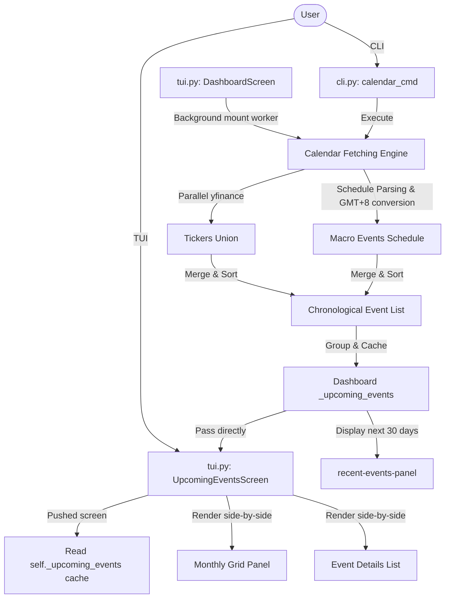

# Technical Documentation: Earnings & Macro Event Calendar

This document details the architecture, design choices, concurrency considerations, caching system, timezone conversions, and verification procedures for the **Earnings & Macro Event Calendar** feature in AssetTrack.

---

## 1. Feature Specifications

The Event Calendar aggregates and displays critical upcoming dates within a rolling 90-day window:
1. **User Holdings Earnings**: Earnings call dates for all stock and ETF tickers in the user's manual positions (as well as underlying stock symbols for options).
2. **SOX Top 10 Semiconductor Holdings**: Earnings dates for the top 10 semiconductor companies:
   - `NVDA`, `AVGO`, `AMD`, `QCOM`, `INTC`, `AMAT`, `LRCX`, `MU`, `ASML`, `TXN`.
3. **Macroeconomic Announcements (Local Time Conversion)**:
   - **FED FOMC Interest Rate Decisions**: Announced at 2:00 PM Eastern Time (ET).
   - **NFP (Non-Farm Payrolls / Unemployment Rate)**: Announced at 8:30 AM Eastern Time (ET).
   - **CPI (Consumer Price Index Inflation)**: Announced at 8:30 AM Eastern Time (ET).

> [!IMPORTANT]
> **GMT+8 Time & Date Adjustments**:
> All macro events are combined with their ET announcement times and converted to the local GMT+8 timezone, accounting for US Daylight Saving Time (DST):
> - **Daylight Time (EDT, GMT-4)**: FED decisions are shifted to **02:00 AM local time the next day** (placing them on the next local calendar day). NFP/CPI convert to **20:30 (8:30 PM) the same day**.
>   - **Standard Time (EST, GMT-5)**: FED decisions are shifted to **03:00 AM local time the next day**. NFP/CPI convert to **21:30 (9:30 PM) the same day**.
> The local GMT+8 date is used for all sorting, preview filters, and calendar grid renderings.

---

## 2. System Architecture

The calendar is fully integrated across the CLI and TUI screens with background loading and state caching:



---

## 3. Core Implementation Details

### A. Parallel Data Fetching
Querying `yfinance` calendar schedules sequentially for up to 20 unique tickers takes 4–5 seconds due to blocking HTTP requests. To optimize performance:
- We use a thread pool (`concurrent.futures.ThreadPoolExecutor`) to run requests in parallel.
- Setting `max_workers` to the total count of unique tickers allows all network queries to run concurrently, reducing the total fetch time to **1.5 to 2.5 seconds**.

### B. Background Caching and Invalidation
To prevent yfinance rate limits and dashboard lag during standard 60-second quote refreshes:
- The dashboard starts an asynchronous background thread `_fetch_upcoming_events_worker` on mount to fetch the 90-day calendar list.
- Once fetched, it stores the list in `self._upcoming_events` and marks `self._events_fetched = True`.
- During subsequent 60-second quote refreshes, standard quotes are updated, but the calendar database is skipped.
- **Invalidation**: Whenever positions are added, modified, or deleted, `self._events_fetched` is set to `False` and a new background calendar fetch is triggered to keep listings in sync.

### C. GMT+8 Timezone Conversion Logic
Macroeconomic announcements are parsed through standard zone files:
```python
import zoneinfo
from datetime import datetime, time, timezone, timedelta

tz_et = zoneinfo.ZoneInfo("America/New_York")
tz_gmt8 = timezone(timedelta(hours=8))

# Combine ET date with ET standard release time
dt_et = datetime.combine(et_date, time_cls(14, 0)).replace(tzinfo=tz_et) # e.g. 14:00 for FED
dt_local = dt_et.astimezone(tz_gmt8)

local_date = dt_local.date()
local_time_str = dt_local.strftime("%H:%M")
```
Using `.astimezone()` automatically applies standard DST adjustments. The returned `local_date` is utilized for chronological sorting and calendar layout placement.

### D. Concurrency & Thread-Safety Fix
During development, wrapping yfinance operations in a global standard output/error redirector (`with silence_output():` which replaces `sys.stdout`/`sys.stderr` globally with a closed file descriptor `os.devnull`) caused race conditions across parallel worker threads. 
- When one thread finished its block, it closed the global `devnull` file descriptor.
- Other active worker threads attempting to write logs/errors encountered a fatal `ValueError: I/O operation on closed file.` crash.
- **Fix**: We removed global stdout/stderr redirections from the parallelized `fetch_cal` functions, ensuring that parallel operations do not modify shared global file streams.

---

## 4. UI Rendering & Monthly Grouping

### CLI Command (`assettrack calendar`)
- Generates a separate `rich.table.Table` for each month in the console.
- Displays GMT+8 times in parentheses next to event names.

### TUI Summary Dashboard Panel (`#recent-events-panel`)
- Replaces the legacy sector breakdown widget next to `#pnl-leaderboard`.
- Slices events occurring within the next 30 days and simplifies event names to keep them compact (e.g. `▼ FED 利率 (02:00)` or `🔔 AAPL 財報`).
- Fits up to 8 events cleanly inside the side-panels layout.

### TUI Calendar Screen (`UpcomingEventsScreen`)
- Pushed onto the screen stack via shortcut `5` or the left sidebar menu option `"📅 近期重大事件"`.
- Uses the cached `_upcoming_events` from the main dashboard, rendering **instantly** without additional fetching overhead.
- Grouped by month and displayed in a **side-by-side visual layout**:
  - **Left Column (Grid Panel)**: A Sunday-based monthly calendar grid where dates with major events are reverse-highlighted and color-coded (green for holdings, yellow for SOX components, and cyan for macro events).
  - **Right Column (Details Panel)**: Lists the events chronologically with days-away counters and local times.

---

## 5. Verification & Tests

An automated integration test has been added to [verify_tui.py](file:///Users/rayyj/Projects/AssetTrack/scripts/verify_tui.py):
- **`verify_upcoming_events_screen`**: 
  - Simulates keyboard key `5` presses.
  - Mounts the `UpcomingEventsScreen` using the cache.
  - Verifies presence of `#events-static`.
  - Returns safely to the dashboard via `escape`.
- **`verify_bindings`**:
  - Confirms keys `1` through `6`, `r`, and `q` are properly registered in `DashboardScreen`.
